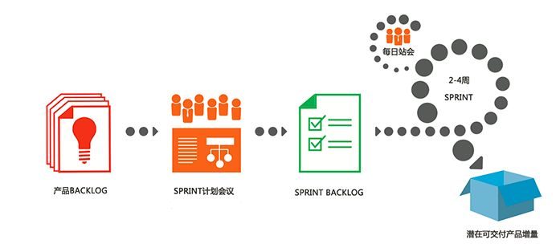
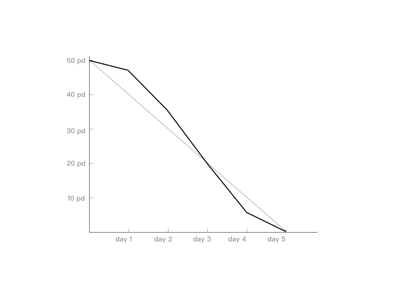

# 初识 Scrum 敏捷
现在互联网公司越来越流行敏捷开发，每个通过敏捷开发的团队都在开发过程中受益匪浅，并且敏捷开发非常适合这种变化多端的互联网行业，在商业上产生了非常大的价值。之所以敏捷越来越受到开发人员和公司的欢迎是因为它改变了整个开发团队的价值观，它让开发团队更加的注重沟通、流程更加简单、更多的反馈、更大的勇气和更加谦逊。

## 什么是敏捷开发
敏捷开发是一种开发模式，它是传统的瀑布模型的优化。传统的瀑布模型将开发的过程分成了几个阶段：制定计划、需求分析、软件设计、程序编写、软件测试和运行维护，看起来是一个非常严谨的步骤，但是它面对这种快速变化的市场是就力不从心了。人们开始对传统的开发模型进行优化，让它更加的符合市场的多变性，这样敏捷开发应运而生。

传统软件开发过程周期过长，并且某个环节出现问题需要从头再来，在生产过程中每个环节都需要耗费大量的成本去保证它的正确性，缺乏并行开发的能力，往往经过一段时间的开发产品出来后，市场同时也产生了很大的变化，并不能够满足当初的预期。

敏捷开发以用户的需求为核心，采用迭代、循序渐进的方法进行软件开发。在很大程度上避免了传统软件开发中的诸多问题，它通过一个一个的小的开发周期，逐步的完成整个项目，每个开发周期内的功能发布后，会通过各种数据再次调整自己的目标并准备下一个开发周期。它是一个适应市场变化的开发模式，很多时候某个功能需要真正的公之于众后才知道它的真正用处，很多时候好的互联网产品的最终形态和它的初衷有非常大的变化，是因为它们会基于某种假设通过一个个小的开发周期，慢慢的修正它的方向，当然这种正确的方向源于用户的真实需求。

## 什么是 Scrum 敏捷开发
Scrum 是一个用于开发和维持复杂产品的框架，在这个框架中，整个开发过程由若干个短的迭代周期组成，每个短的迭代周期称为一个 Sprint，每个 Sprint 建议长度为 2 周或者 4 周，对于快速变化的互联网行业可以使用 1 周的长度。在 Scrum 中，产品需求是通过 Backlog 来管理的，Backlog 的优先级是通过商业价值的高低来排列，Backlog 每个需求项通常是以 Userstory 的形式体现，Scrum 团队会优先开发商业价值高的需求。Scrum 团队会通过讨论，将优先级高的的需求从 Backlog 中挑选出来，这些需求是刚好满足一个 Sprint 的工期任务，这个任务列表我们称之为 Sprint Backlog，当然这些任务加起来必须是一个可用的产品。这样一来产品会通过一个一个的 Sprint 来完善，并最终达到用户终极目标。

Scrum 流程图：

Scrum 敏捷模型中还存在一些角色、一些工具、一些活动和价值观，让我们进一步了解一下。

## Scrum 敏捷开发的角色
### Product Owner
产品负责人负责最大化产品以及开发团队工作的价值。他是 Backlog 的唯一负责人：

* 清晰的表达产品 Backlog 每个需求项目；
* 对 Backlog 进行排序，最好的实现目标；
* 确保开发团队所执行工作的价值；
* 确保 Backlog 对所有人可见、透明、清晰，并且显示 Scrum 团队的下一步工作；
* 确保 Scrum 团队对 Backlog 中的每一条都达到一定程度的理解。

为了确保开发的顺利进行，任何人都不得要求开发团队按照另一套需求开展工作，开发团队也不允许听从任何其它人的需求，除了自己团队的产品负责人。

### Scrum Master
Scrum Master 在 Scrum 团队中起到服务务式领导的作用，他确保团队更好的按照 Scrum 模式来实施，会帮助大家遵循 Scrum 的理论、实践和规则。Scrum Master 是团队的教练，帮助团队健康成长：

* 指导团队按照正确的 Scrum 方式开展工作；
* 清除障碍，确保团队在一个干净的环境中工作；
* 及时沟通；

Scrum Master 越来越受到团队的重视，通常他会让一个团队越来越健康，优秀的 Scrum Master 拥有这样的特质：责任心、谦虚、协作、有影响力、影响力、知识渊博。

### 开发团队
开发团队就是更佳专业的人员，例如：工程师、设计师、交互工程师等等，他们是真正创造价值的角色：

* 自组织；
* 可以跨团队；
* 他们都是开发者；

## Scrum 敏捷开发的工具
### Product Backlog
Product Backlog 可以看作是所有的需求池，产品经理会将所有的需求整理到 Backlog 中去，并且越是排在前面的需求，需求的描述越准确涉及到的细节也越丰富并且在商业上的价值也是越大的。当然它的内容和优先级并不是一成不变的，它一直在变化，随着市场、需求、技术等原因一直在调整。

### Sprint Backlog
Sprint Backlog 中的需求项来自于 Product Backlog，它是一份足够具体的计划，它是整个团队讨论的结果，它讨论得越具体详细，在开发的过程中就越接近目标，Sprint 的交付日期也越准确。它也是在不断变化的，当需求产生了变化，需要对需求工作量再次评估，并对未完成的 Sprint Backlog 进行调整（插入或者去除任务）。

### Burn-down Chart
燃尽图是用来反应工作完成情况的趋势图，图中 x 轴代表 Sprint 的工作日，y 轴代表剩余工作量，团队会根据每天的进展发布燃尽图，理想情况下 Sprint 结束时，累积工作量降低到 0，Sprint 就成功结束，下图中浅色的线为理想中的燃尽曲线，但是往往实际情况（深色线）中它会波动，从燃尽图的走势，我们可以很好的控制项目的发展情况。

## Scrum 敏捷开发的活动
### Sprint 计划会议
每个 Sprint 都以 Sprint 计划会议作为开始，这是一个固定时长的会议，在这个会议中,Scrum团队共同选择和理解在即将到来的 Sprint 中要完成的工作。这个会议中需要解决两个问题：

* 决定在 Sprint 中需要完成哪些工作；
* 决定这些工作如何完成。

### 每日站立会
每日站立会主要是开发团队内部组织，每天在同样的时间和地点召开，每个开发成员需要描述自己以下三个信息：

* 我完成了什么；
* 我计划完成什么；
* 我遇到了什么问题？

它并不是一个回报会议，是团队内部的沟通会议，它的透明性帮助我们很好的发现问题并促进项目的快速进行，这个会议不能太长，最多 15 分钟。

### Sprint 评审会议
在 Sprint 结束时，Scrum 团队和相关⼈人员一起评审 Sprint 的产出。围绕着 Sprint 中完成的增量进行讨论，大家都可发言，这个会议是个⾮非正式的会议，帮助⼤大家了解我们目前进展到哪⾥里，并一起讨论我们下一步如何推进。当然此事产品负责人会对未来做出最终的决定，并适当地调整 Product Backlog。

### Sprint 回顾会议
在每个 Sprint 结束后，Sprint 团队会聚集在一起对本次 Sprint 进行一次回顾总结，大家指出哪些做的好，哪些做得不好，并找出潜在的改进事项，为将来的改进制定计划。

## 敏捷开发与传统开发的不同
敏捷开发与传统的开发有很多不同之处，它的高效和快速响应正式传统开发模式无法比拟的：

* 周期短；
* 响应快；
* 效率高，所有的事情都是迭代进行；
* 弱化文档；

## 参考
http://www.scrumcn.com/agile/scrum-knowledge-library/scrum.html

