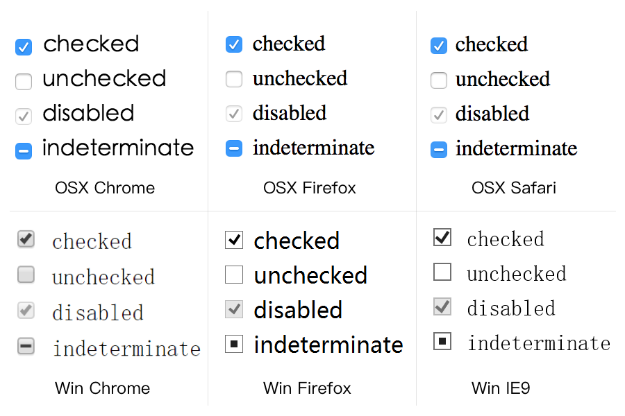

# checkbox 的四种状态
checkbox 是 HTML 中非常常用的控件，它可以作为多选控件，很多开发人员知道它有三种状态：`checked`、`unchecked`、`disabled`，其实它还有第四种鲜为人知的状态`indeterminate`。

## indeterminate
`indeterminate`属性用来表示 checkbox 元素的状态为**不确定**，不同的平台和浏览器对于这种状态的显示不一样，在 Chrome 下为一个横杠，在 Firefox 下为实心正方形：



## 设置 indeterminate 状态
`checked`、`unchecked`、`disabled`可以通过 HTML 属性直接设置，但是`indeterminate`只能通过 JavaScript 来设置：

```
document.getElementById("ckb").indeterminate = true;
```

## indeterminate CSS 伪类
类似于`:checked`和`:unchecked`伪类，我们也可以使用`:indeterminate`伪类进行对不确定状态的 checkbox 的选取：

```
checkbox:indeterminate {
	
}
```


