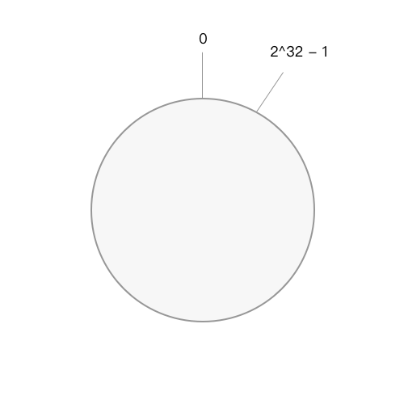
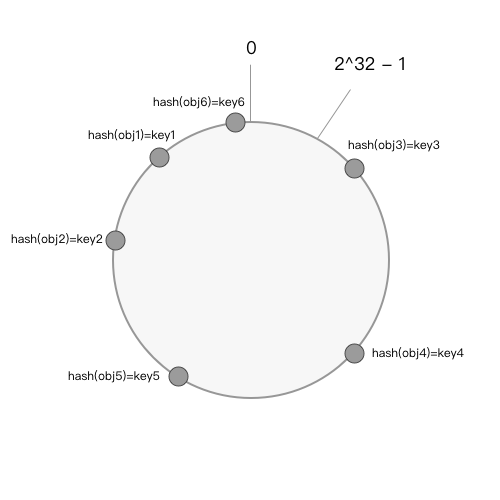
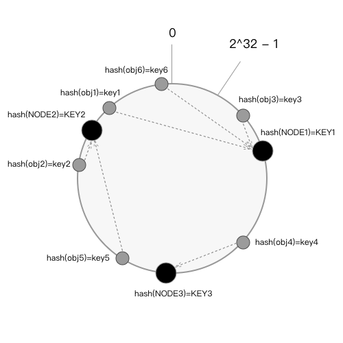
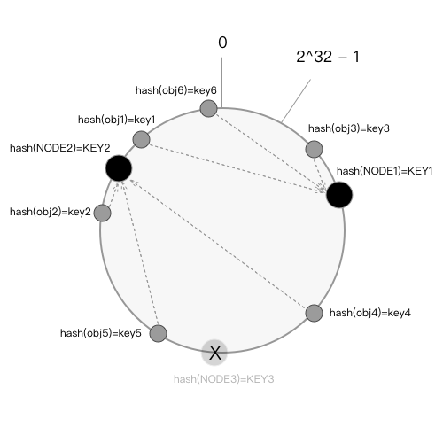
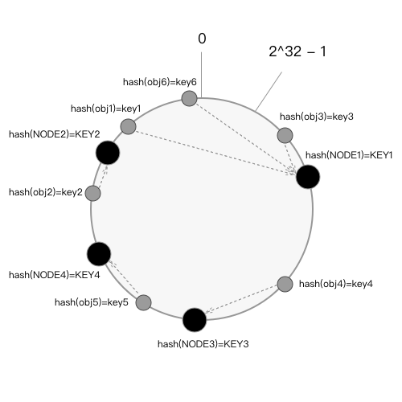
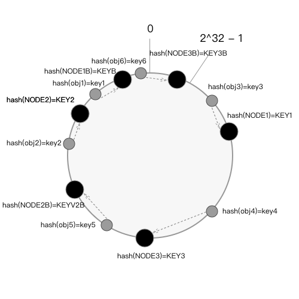

# 一致性 Hash 算法
一致性哈希算法在1997年由麻省理工学院提出，设计目标是为了解决因特网中的热点(Hot spot)问题，初衷和CARP十分类似。一致性哈希修正了CARP使用的简单哈希算法带来的问题，使得DHT可以在P2P环境中真正得到应用。（来自百度百科）

现在一致性哈希算法广泛的运用于分布式系统中，它不仅有良好的平衡性，而且有很好的单调性；这样它让分布式系统能够平摊所有的计算，并且在增加和减少集群中的机器是也不会产生太大的负荷影响其它服务器。

## 一致性 Hash 的特性
良好的分布式集群系统中，一致性 Hash 算法应该满足 4 个适应条件：

### 均衡性
### 单调性
### 分散性
### 负载

## 原理
### 环形 Hash 空间
用 Hash 算法将对应计算出来的 Key 映射到 32 位的值中，即0 到 (2^32 - 1)的数字空间。我们可以把它想象成这些数字首尾相连的封闭环形。



### 把对象映射到环形 Hash 空间
我们可以将 obj1、obj2、obj3、obj4、obj5 五个对象通过 Hash 算法计算出来的 key 值映射到环形 Hash 空间。

```
Hash(obj1) = key1;
Hash(obj2) = key2;
Hash(obj3) = key3;
Hash(obj4) = key4;
Hash(obj5) = key5;
```



### 将集群的机器映射到环形 Hash 空间
同样我们将三台机器 NODE1、NODE2、NODE3 三台机器 通过 Hash 算法计算出来的 KEY 值映射到环形 Hash 空间。

```
Hash(NODE1) = KEY1;
Hash(NODE2) = KEY2;
Hash(NODE3) = KEY3;
```



### 将对象存储到机器
现在在环形 Hash 空间中既有对象也有机器，接下来我们将对象存储到机器：通常我们会将在某个 object 存储在它沿着这个环形空间顺时针方向最近的一个 NODE 上。这样以来我们就可以将所有的对象存储到相应的机器上了，当然去获取该对象也是采用同样的原理找到该机器然后去获取。

### 删除节点
如果要去除分布式集群的某一台机器 NODE3，此时只会影响到沿着节点 NODE3 逆时针遍历到节点 NODE1 之间的对象，也就是本来映射到 NODE3 的所有对象，并且这些对象将直接映射到 NODE2。



### 增加节点
如果要在分布式集群中增加一台机器 NODE4，假设此节点被映射到对象 obj2 和 obj5 之间，此时会影响节点 NODE4 逆时针便利到节点 NODE3 之间的对象，它们会被重新映射到 NODE4。



### 虚拟节点
我们看前面的将对象映射到节点的图，其中节点 NODE1 中存储了 obj1、obj6、obj3；节点 NODE2 存储了obj5、obj2；节点 NODE3 只存储了 obj4，这看起来是非常不均匀的，并不符合平衡性。此时我们引入虚拟节点，假设我们将节点都复制一个出来，意味这我们将会有 6 个节点，如果在一个比较理想的情况下，保证所有节点都均匀的分配所有对象，就像下图一样：最终 NODE1 存储obj1 和 obj 3，NODE2 存储 obj5 和 obj2，NODE3 存储 obj4 和 obj6。




