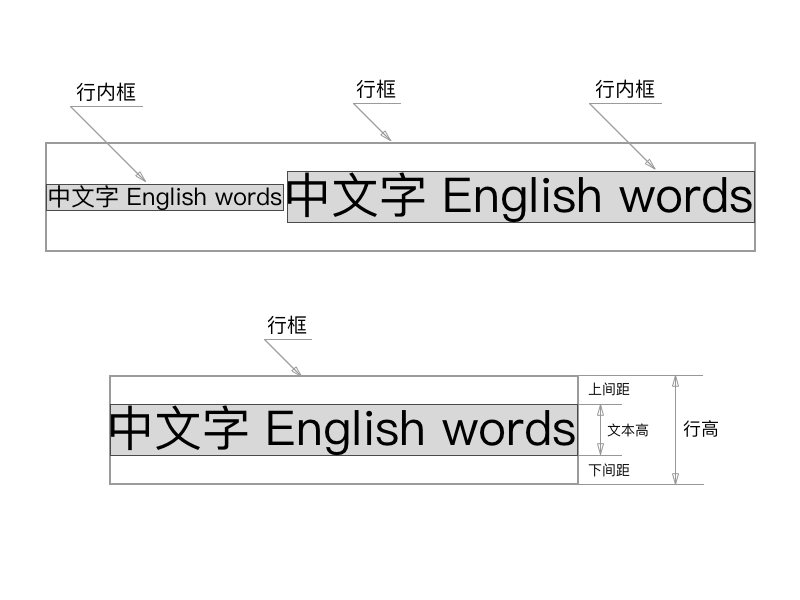
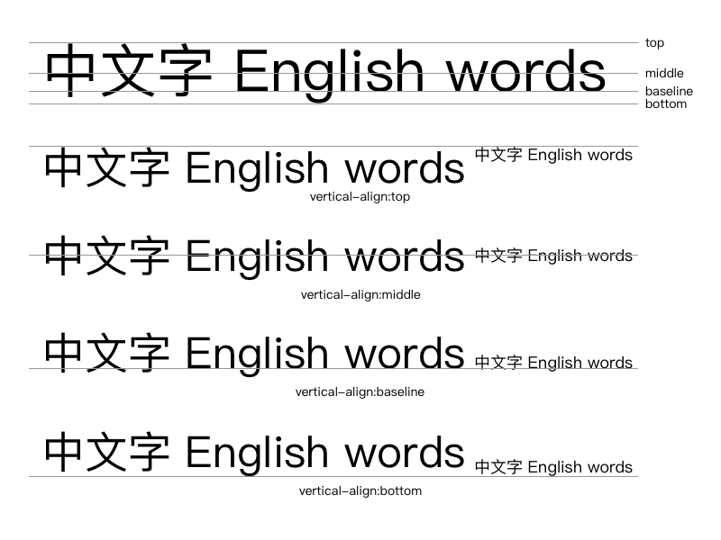
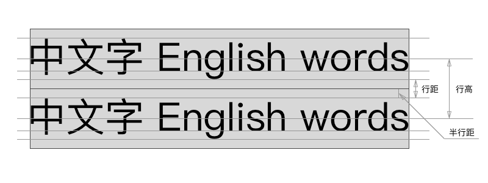

# CSS line-height
在 CSS 中经常会设置文本之间的行高`line-height`，到底行高是如何定义的，它和文字的底线、基线、中线、顶线有什么关系？

## 行框
行框（line box）是文字一行的虚拟矩形框，它并没有实际的现实，是浏览器渲染文字的一种规则。行框高度等于本行内所有元素中行内框最大的值（以行高值最大的行内框为基准，其他行内框采用自己的对齐方式向基准对齐，最终计算行框的高度），当有多行内容时，每行都会有自己的行框。

## 文字的四条线
在`vertical-align`样式属性中有四个选项：`top`、`middle`、`baseline`和`bottom`，它们对应以下的四条线：

## 行高、行距、半行距
多行文字之间还有一些距离：行高、行距和半行距，它们三者之间的关系又是如何的：

