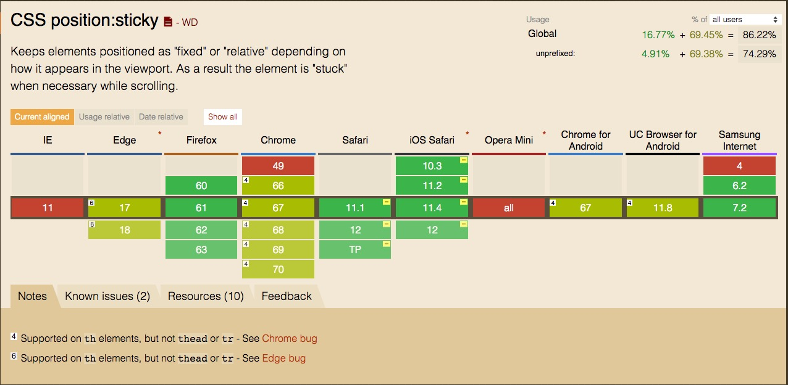

# CSS3 sticky 粘性布局
在 CSS 中位置属性 `position` 大家对 `relative`、`fixed`、`absolute` 已经用的非常熟悉了，在 CSS3 中出现了 `sticky` 这个特殊的定位方式。

## 功能描述
在 W3C 标准中 `sticky` 功能描述：元素的位置基于用户滚动位置定位，`sticky` 定位的元素位置在 `relative` 和 `fixed` 之间切换，具体取决于滚动位置。它会被相对定位，直到浏览器可是区域中满足给定的偏移位置，否则会被粘住到固定的位置。（[W3C Positon](https://www.w3schools.com/cssref/pr_class_position.asp)）

如何理解它的定位方式呢，我们直接上 Demo：

```
<!DOCTYPE html>
<html>
<head>
<style>
.title {
    position: sticky;
    top: 0;
    padding: 5px;
    background-color: #ccc;
}
.item {
    height: 50px;
    line-height: 50px;
}
</style>
</head>
<body>
    <h1>Contacts</h1>
    <div class="title">A</div>
    <div class="item">啊三</div>
    <div class="item">啊五</div>
    <div class="item">apple</div>
    <div class="item">Alph</div>
    <div class="item">ABC</div>
    <div class="item">apple</div>
    <div class="item">Alph</div>
    <div class="item">ABC</div>
    <div class="item">apple</div>
    <div class="item">Alph</div>
    <div class="item">ABC</div>
    <div class="title">B</div>
    <div class="item">Banana</div>
    <div class="item">Back</div>
    <div class="item">Banana</div>
    <div class="item">Back</div>
    <div class="item">Banana</div>
    <div class="item">Back</div>
    <div class="item">Banana</div>
    <div class="item">Back</div>
    <div class="item">Banana</div>
    <div class="item">Back</div>
    <div class="title">C</div>
    <div class="item">China</div>
    <div class="item">Cat</div>
    <div class="item">Cookie</div>
    <div class="item">Cake</div>
    <div class="item">Color</div>
    <div class="item">China</div>
    <div class="item">Cat</div>
    <div class="item">Cookie</div>
    <div class="item">Cake</div>
    <div class="item">Color</div>
</body>
</html>
```

运行上面的 Demo，大家会看到和 iPhone 通讯录类似的效果，通讯录的标题（首字母），会随着屏幕的滚动固定到屏幕的顶部。

## 兼容性
它的兼容性比起 `relative`、`fixed`、`absolute` 相对差一些 [caniuse](https://caniuse.com/#feat=css-sticky)：



## 最后
这种新的布局方式，让我们 web 前端又有了新的设计方式，虽然兼容性有待提高，但是随着浏览器的迭代更新，它会被越来越多的浏览器厂商支持，它的确给我们的开发更佳的简单。


