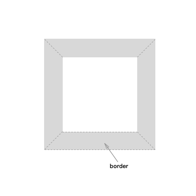
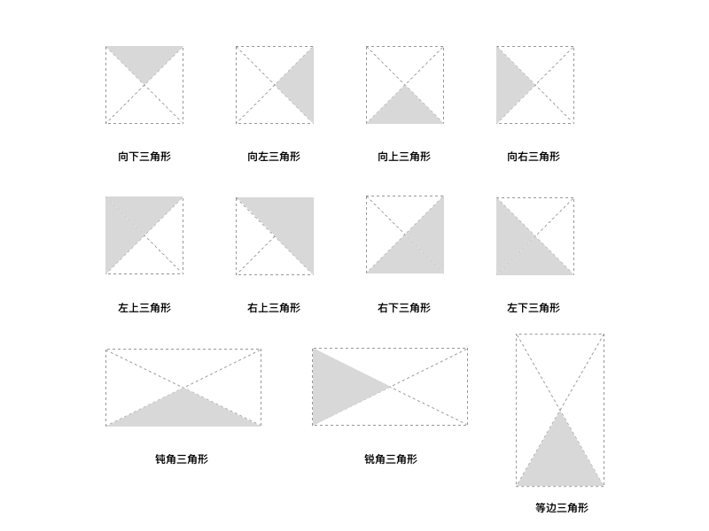
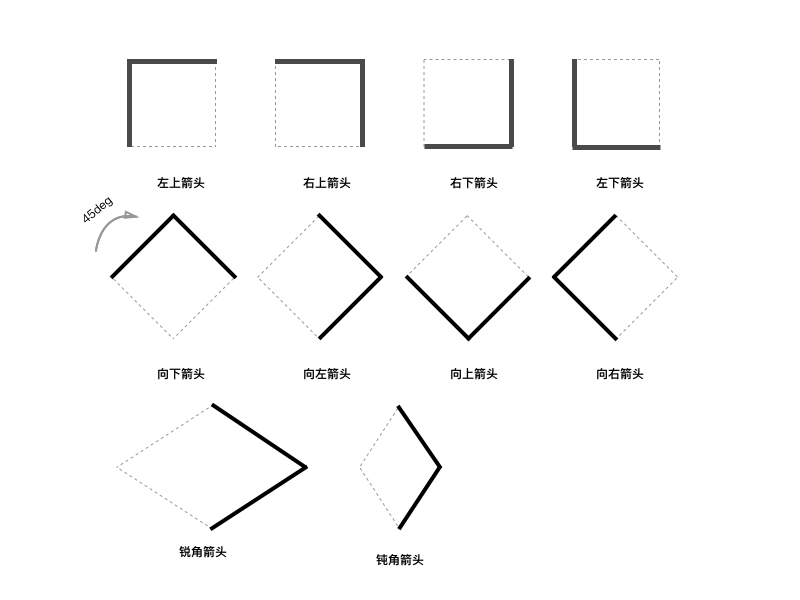

# 如何用 CSS 画三角形和箭头
三角形和箭头这两个图标在网页中经常会用到，例如：下拉选择框、排序、返回到上一页、导航条，分页都会用到三角形或者箭头，当然是用图片的方式的确可以实现这一样式，但是是用图片如果调整颜色那就比较困难了，除非再做一张图片，这样的做不仅浪费开发成本并且会降低网页性能。我们可以采用 CSS 画出三角形或者箭头：

## 使用 border 画三角形和箭头
一条边框在和模型中其实并不是一条线，如果我们将边框设置得足够大，并且设置不同的颜色，我们就很容易看到边框的本质，从下图很容易可以看出其事 border 在一个正方形 DOM 上其实是一个梯形：



### 画三角形
利用这一原理我们可以将 DOM 的高和宽设置为 0 像素，通过设置边框的颜色透明来画出不同的三角形，当然也可以来设置 border 的宽度来画出不同角度的三角形：




```
.triangle {
	width: 0;
	height: 0;
	border-top: 50px solid #ccc;
	border-left: 50px solid transparent;
	border-right: 50px solid transparent;
}
```

### 画箭头
那么如何才用 border 来画箭头乐，只需要用一个边框（颜色需要和背景颜色一致）来重叠挡住另外一个边框即可。

### 优势和缺点

* [优势]兼容 IE；
* [优势]颜色可控；
* [缺点]不能画出空心透明的三角形；
* [缺点]高度和宽度很难控制，需要一定的计算；

## 使用 transform 和 border 画三角形和箭头
CSS 3 的出现，让 DOM 有了变形的效果，我们可以通过一些简单的旋转变形来画出三角形或者箭头。

### 画箭头
利用边框加上旋转，我们设置两个相邻的边框，然后做 45 度的旋转，这样就可以得到不同类型的箭头了：



```
.arrow {
	width: 50px;
	height: 50px;
	border-top: 5px solid #ccc;
	border-left: 5px solid #ccc;
	transform: rotate(45deg)
}
```

### 画三角形
如果要画三角形的话，我们需要在这个箭头上增加一条变长线就可以了。

### 优势和缺点

* [优势]颜色可控；
* [缺点]不能画出实心的三角形；
* [缺点]高度和宽度很难控制，需要一定的计算；
* [缺点]不兼容低版本 IE

## 其它方式
当然还有其它的方式来画三角形和箭头：

* Canvas
* SVG
* CSS 点阵

## 总结
这两种画法都存在有有缺点，应该根据具体的应用场景来确定使用哪种方式。当然我们之所以采用 CSS 来画一些图形，是因为我们在模块化和性能上做考虑，尽量在组件级别的 CSS 少使用图片。


