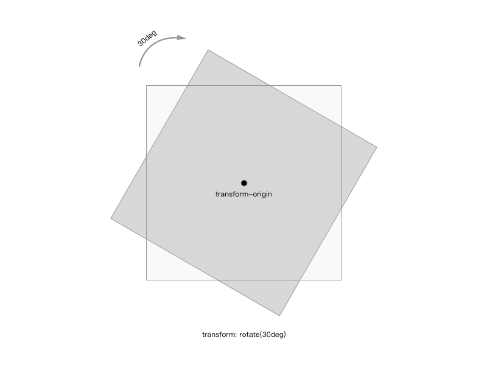
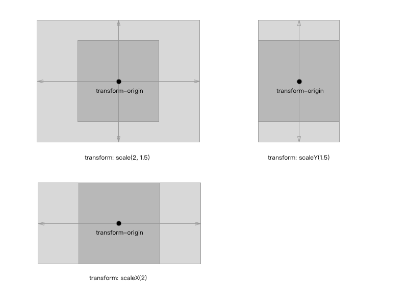
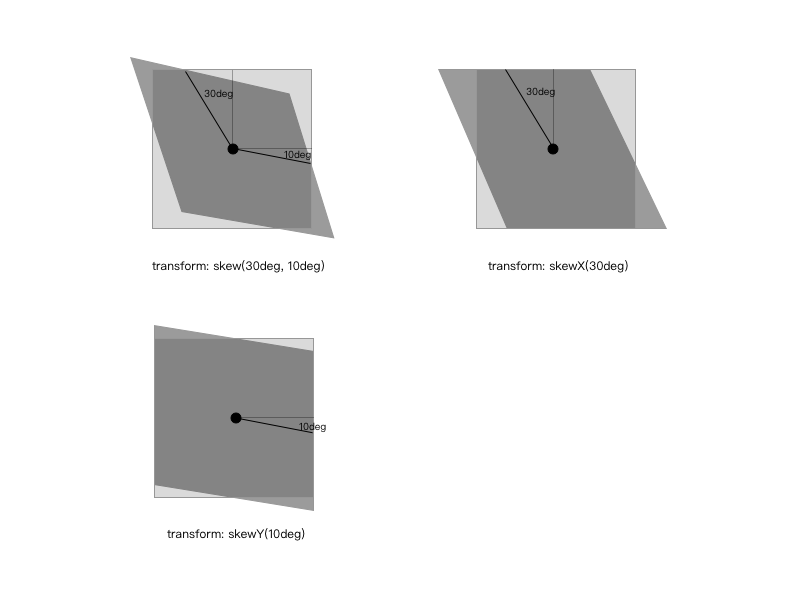

# CSS3 动画
在 CSS3 出现之前，动画都是通过 JavaScript 动态的改变元素的样式属性来完成了，这种方式虽然能够实现动画，但是在性能上存在一些问题。CSS3 的出现，让动画变得更加容易，性能也更加好。
CSS3 中有三个关于动画的样式属性`transform`、`transition`和`animation`；

## transform
`transform`可以用来设置元素的形状改变，主要有以下几种变形：`rotate`（旋转）、`scale`（缩放）、`skew`（扭曲）、`translate`（移动）和`matrix`（矩阵变形），语法如下：

```
.transform-class {
	transform ： none | <transform-function> [ <transform-function> ]*
}
```

`none`表示不做变换；`<transform-function>`表示一个或多个变化函数，变化函数由函数名和参数组成，参数包含在`()`里面，用**空格**分开，例如：

```
.transform-class {
	transform ： rotate(30deg) scale(2,3);
}
```

### transform-origin 基点
所有的变形都是基于基点，基点默认为元素的中心点。用法：`transform-origin: (x, y)`，其中 x 和 y 的值可以是百分比、rem 或者是 px 等等，也可以用表示位置的单词来表示例如：x 可以用`left`、`center`、`right`；y 可以用`top`、`center`、`bottom`。

```
.transform-class {
	transform-origin: (left, bottom);
}
```

### rotate 旋转
用法：`rotate(<angle>)`；表示通过指定的角度对元素进行旋转变形，如果是正数则顺时针旋转，如果是负数则逆时针旋转，例如：

```
.transform-rotate {
	transform: rotate(30deg);
}
```



### scale 缩放
它有三种用法：`scale(<number>[, <number>])`、`scaleX(<number>)`和`scaleY(<number>)`；分别代表水平和垂直方向同时缩放、水平方向的缩放以及垂直方向的缩放，入参代表水平或者垂直方向的缩放比例。缩放比例如果大于1则放大，反之则缩小，如果等于1代表原始大小。

```
.transform-scale {
	transform: scale(2,1.5);
}

.transform-scaleX {
	transform: scaleX(2);
}

.transform-scaleY {
	transform: scaleY(1.5);
}
```



### translate 移动
移动也分三种情况：`translate(<translation-value>[, <translation-value>])`、`translateX(<translation-value>)`和`translateY(<translation-value>)`；分别代表水平和垂直的移动、水平方向的移动以及垂直方向同时移动，移动单位是 CSS 中的长度单位：`px`、`rem`等;

```
.transform-translate {
	transform: translate(400px, 20px);
}

.transform-translateX {
	transform: translateX(300px);
}

.transform-translateY {
	transform: translateY(20px);
}
```


### skew 扭曲
扭曲同样也有三种情况，`skew(<angle>[, <angle>])`、`skewX(<angle>)`和`skewY(<angle>)`；同样也是水平和垂直方向同时扭曲、水平方向的扭曲以及垂直方向的扭曲，单位为角度。

```
.transform-skew {
	transform: skew(30deg, 10deg);
}

.transform-skewX {
	transform: skewX(30deg);
}

.transform-skewY {
	transform: skewY(10deg);
}
```


### matrix
矩阵变形相对来说非常复杂，涉及到数学中的矩阵计算，有兴趣的同学可以研究一下：[CSS3 Transform Matrix](http://www.tuicool.com/articles/na6jy2)

## transition 
`transition`是用来设置样式的属性值是如何从从一种状态变平滑过渡到另外一种状态，它有四个属性：

* transition-property（变换的属性，即那种形式的变换：大小、位置、扭曲等）；
* transition-duration（变换延续的时间）；
* transition-timing-function（变换的速率）
* transition-delay（变换的延时）

```
.transition-class {
	transition ： [<'transition-property'> || <'transition-duration'> || <'transition-timing-function'> || <'transition-delay'> [, [<'transition-property'> || <'transition-duration'> || <'transition-timing-function'> || <'transition-delay'>]]*;
}
```

### transition-property
它是用来设置哪些属性的改变会有这种平滑过渡的效果，主要有以下值：

* none；
* all；
* 元素属性名：
	* color；
	* length；
	* visibility；
	* ...

```
.transition-property {
	transition-property ： none | all | [ <IDENT> ] [ ',' <IDENT> ]*;
}
```

### transition-duration
它是用来设置转换过程的持续时间，单位是`s`或者`ms`，默认值为0；

```
.transition-duration {
	transition-duration ： <time> [, <time>]* ;
}
```

### transition-timing-function
它是来设置过渡效果的速率，它有6种形式的速率：

* ease：逐渐变慢（默认），等同于贝塞尔曲线(0.25, 0.1, 0.25, 1.0)；
* linear：匀速，等同于贝塞尔曲线(0.0, 0.0, 1.0, 1.0)；
* ease-in：加速，等同于贝塞尔曲线(0.42, 0, 1.0, 1.0)；
* ease-out：减速，等同于贝塞尔曲线(0, 0, 0.58, 1.0)；
* ease-in-out：先加速后减速，等同于贝塞尔曲线(0.42, 0, 0.58, 1.0)；
* cubic-bezier：自定义贝塞尔曲线。

```
.transition-timing {
	transition-timing-function ： ease | linear | ease-in | ease-out | ease-in-out | cubic-bezier(<number>, <number>, <number>, <number>) [, ease | linear | ease-in | ease-out | ease-in-out | cubic-bezier(<number>, <number>, <number>, <number>)]*;
}
```

#### 贝塞尔曲线


### transition-delay
它是来设置过渡动画开始执行的时间，单位是`s`或者`ms`，默认值为0；

```
.transition-delay {
	transition-delay ： <time> [, <time>]*;
}
```

### transition
它是`transition-property`、`transition-duration`、`transition-timing-function`、`transition-delay`的简写：

```
.transition {
	transition ：<property> <duration> <timing function> <delay>;
}
```

## animation
`animation`比较类似于 flash 中的**逐帧动画**，逐帧动画就像电影的播放一样，表现非常细腻并且有非常大的灵活性。然而`transition`只是指定了开始和结束态，整个动画的过程也是由特定的函数控制。学习过 flash 的同学知道，这种逐帧动画是由**关键帧**组成，很多个关键帧连续的播放就组成了动画，在 CSS3 中是由属性`keyframes`来完成逐帧动画的。

### @keyframes

```
@keyframes animationName {
	from {
		properties: value;
	}
	percentage {
		properties: value;
	}
	to {
		properties: value;
	}
}
//or
@keyframes animationName {
	0% {
		properties: value;
	}
	percentage {
		properties: value;
	}
	100% {
		properties: value;
	}
}
```

* animationName：动画名称，开发人员自己命名；
* percentage：为百分比值，可以添加多个百分比值；
* properties：样式属性名称，例如：`color`、`left`、`width`等等。

### animation-name
它是用来设置动画的名称，可以同时赋值多个动画名称，用`,`隔开：

```
.animation {
	animation-name: none | IDENT[,none | IDENT]*;
}
```

### animation-duration
它是用来设置动画的持续时间，单位为`s`，默认值为`0`：

```
.animation {
	animation-duration: <time>[,<time>]*;
}
```
### animation-timing-function
和`transition-timing-function`类似：

```
.animation {
	animation-timing-function:ease | linear | ease-in | ease-out | ease-in-out | cubic-bezier(<number>, <number>, <number>, <number>) [, ease | linear | ease-in | ease-out | ease-in-out | cubic-bezier(<number>, <number>, <number>, <number>)]*;
}
```

### animation-delay
它是来设置动画的开始时间，单位是`s`或者`ms`，默认值为0：

```
.animation {
	animation-delay: <time>[,<time>]*;
}
```

### animation-iteration-count
它是来设置动画循环的次数，默认为`1`，`infinite`为无限次数的循环：

```
.animation {
	animation-iteration-count:infinite | <number> [, infinite | <number>]*;
}
```

### animation-direction
它是来设置动画播放的方向，默认值为`normal`表示向前播放，`alternate`代表动画播放在第偶数次向前播放，第奇数次向反方向播放：

```
.animation {
	animation-direction: normal | alternate [, normal | alternate]*;
}
```

### animation-play-state
它主要是来控制动画的播放状态：`running`代表播放，而`paused`代表停止播放，`running`为默认值：

```
.animation {
	animation-play-state:running | paused [, running | paused]*;
}
```

### animation
它是`animation-name`、`animation-duration`、`animation-timing-function`、`animation-delay`、`animation-iteration-count`、`animation-direction`的简写：

```
.animation {
	animation:[<animation-name> || <animation-duration> || <animation-timing-function> || <animation-delay> || <animation-iteration-count> || <animation-direction>] [, [<animation-name> || <animation-duration> || <animation-timing-function> || <animation-delay> || <animation-iteration-count> || <animation-direction>] ]*;
}
```

### 举个栗子


## 总结一下
关于 CSS3 的动画的三个属性`transform`、`transition`、`animation`我们都介绍完了，让我们回顾一下。`transform`我们可以理解为元素的几何变形，它是有规律可寻的，这种变形并不会产生动画效果仅仅是原有形状的改变；`transition`和`animation`它们很像 flash 中的**补间动画**和**逐帧动画**；`transition`是从一个状态变化到另外一种状态，当变化有了平滑的效果后就产生了动画，它是一个公式化的变化，在比较规则的动画效果中我们可以使用，例如：旋转的风车、行驶的汽车、颜色的渐变等等；`animation`的动画效果更加灵活，可以实现像影片一样的复杂无规则的动画。


