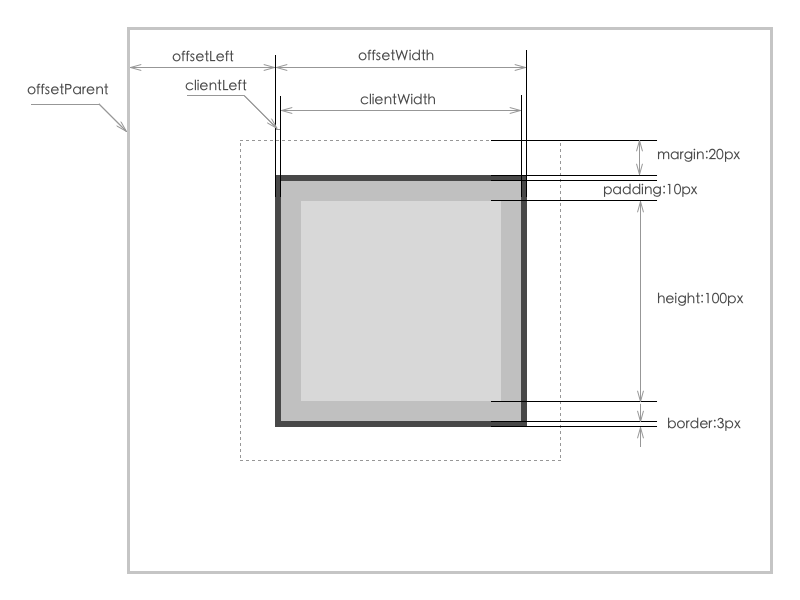
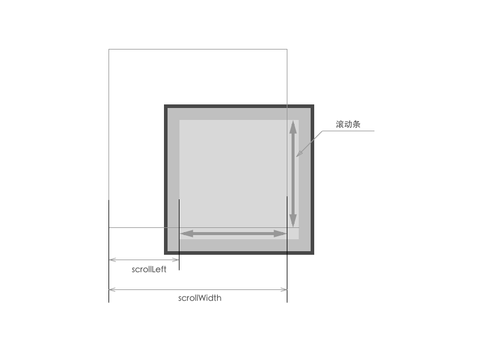
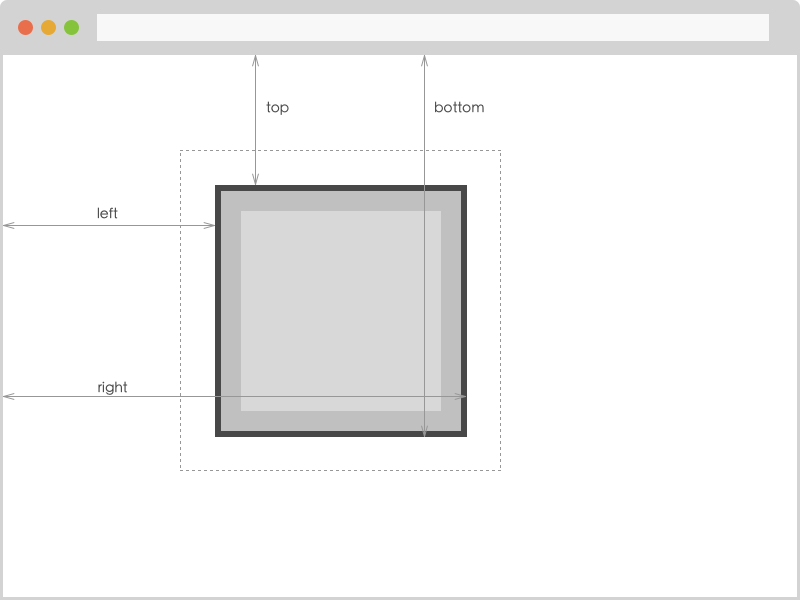

# DOM 尺寸和位置
我们经常在页面中，对 DOM 进行一些复杂的操作和计算中会对元素的尺寸和位置做计算，要想对元素的尺寸和位置很好的控制我们必须了解以下知识：

* clientWidth & clientHeight
* clientLeft & clientTop
* offsetWidth & offsetHeight
* offsetLeft & offsetTop
* offsetParent
* scrollWidth & scrollHeight
* scrollLeft & scrollTop
* getBoundingClientRect()

## clientWidth & clientHeight
它们分别表示 DOM 的宽度和高度即元素的内容+内边距的大小，不包含 border 和 margin：

## clientLeft & clientTop
它们表示 DOM 内边距到边框外边缘之间的水平和垂直距离，也就是左、上边框宽度：

## offsetWidth & offsetHeight
它们表示 DOM 的内容+内边距+边框的大小，不包含 margin：

## offsetLeft & offsetTop
它们表示 DOM 边框外边缘与已定为父容器对象的距离：

## offsetParent
它表示该元素最近的定位祖先元素，递归上溯，如果没有的话则返回 null：

## scrollWidth & scrollHeight
它们表示元素的内容区域+内边距+溢出的尺寸，当内容整好喝内容区域没有溢出时，它们与 clientWidth & clientHeight 相等：

## scrollLeft & scrollTop
它们表示内容溢出的水平左边和垂直顶部的距离，也就是滚动条水平和垂直拖动的距离：

## getBoundingClientRect() 
它会返回一个有 left、right、top、bottom、height、width 属性的对象，分别表示元素四个位置相对于窗口的坐标（注意：它们都是给予浏览器的左上边缘），其中返回的 height 和 width 包含内边距和边框：

