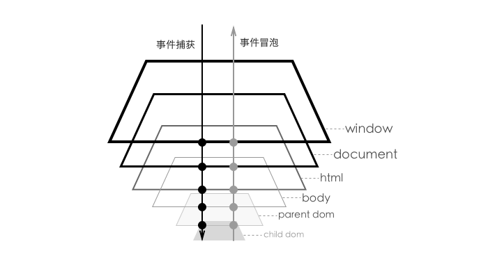

# 事件的冒泡

## 什么是事件冒泡
当事件(`event`)触发在某个元素上时，如果这个事件绑定了方法那么这个方法会被执行，如果没有绑定方法或者被绑定的方法返回`true`，那么这个事件会向其父级传播，一层一层直到最顶层即`document`或者`window`，除非被认为的中断。

## 冒泡机制
现代浏览器的冒泡机制基本一致，时间都是由最内层的元素网最外层元素冒泡，冒泡顺序：child->paren->body->html->document->window。可能早期浏览器（IE5、IE6等）有所区别。

## 事件捕获
事件的捕获刚好和冒泡的方向相反，由最外层开始捕获，然后到最内层，捕获顺序：window->document->html->body->paren->child。

## DOM 的事件流
事件捕获优先发生而冒泡后发生，这样一来从捕获到冒泡形成了一组事件流。

通过`addEventListener(event,fn,useCapture)`这个方法给 DOM 绑定事件时，前两个参数很容易理解一个是事件名称`event`，第二个是触发方法`fn`，其中第三个参数是一个 bool 值，用来设置绑定的方法是在事件捕获(true)时执行还是冒泡(false)时执行，一般我们会设置 false，这样比较安全。

## 阻止事件冒泡
通常情况下，我们不会去做阻止事件冒泡的事情，但是有时候当我们不想同时执行绑定在两个 DOM 元素上的事件时，我们需要手动的阻止事件的冒泡，通常我们使用如下几种方式来阻止：

* `return false`：阻止默认事件和冒泡事件；
* `event.preventDefault()`：阻止默认事件但是允许冒泡事件；
* `event.stopPropagation()`：阻止冒泡但是允许默认事件；

**默认事件：该元素默认执行的动作。例如：button 的默认事件是 submit，a 的默认事件是打开链接 等等**

