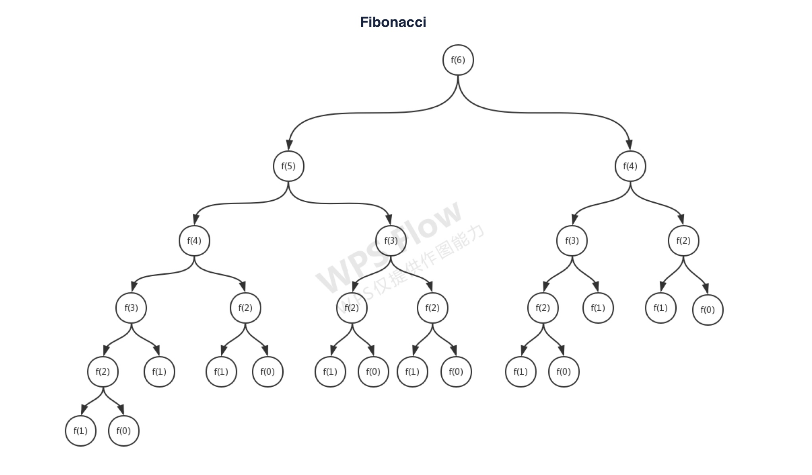
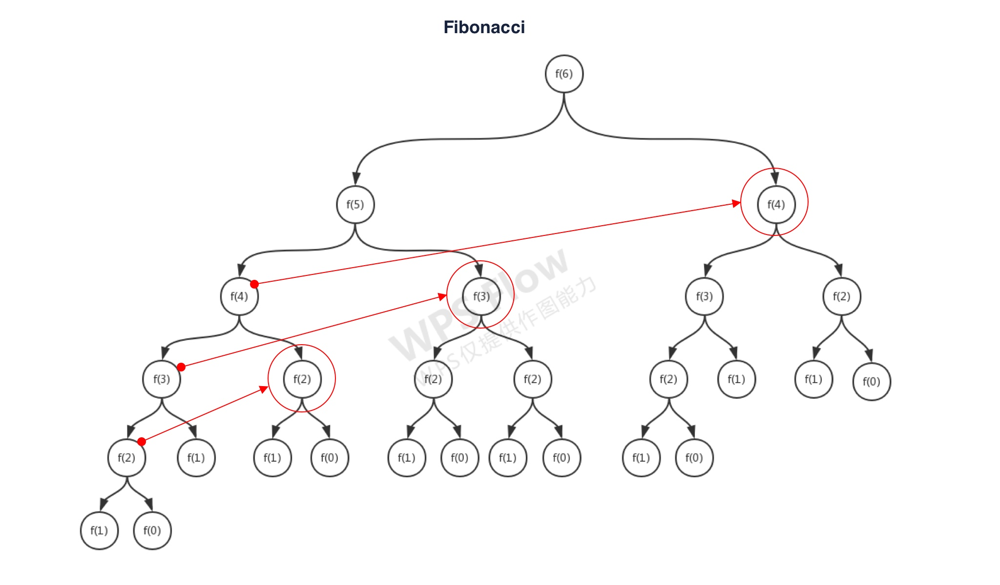

# 斐波那契数列
斐波那契数列（Fibonacci sequence），又称黄金分割数列，是数学家列昂纳多·斐波那契（Leonardoda Fibonacci）发明的一串神奇的数列：`0、1、1、2、3、5、8、13、21、34……`，它的推到过程：F(0)=0，F(1)=1，F(2)=1, F(n)=F(n - 1)+F(n - 2)（n ≥ 3，n ∈ N*）。我们很容易能够看出来：每一项（除了第一第二项）都是前面两项的和。

## 分析
这个自带公式的问题，首先解决了我们的第一大难题：递推公式（或者说状态转移方程）`F(n) = F(n - 1) + F(n - 2)`。有了这一公式，我们就可以开始求解这一问题了。围绕这一公式，我们可以先看看从整体到局部的解决方式：



从上面的图可以看出，要想得到`F(5)`的解，必须要得到`F(4)`和`F(3)`的解；要想得到`F(4)`的解，必须要得到`F(3)`和`F(2)`的解；要想得到`F(3)`的解，必须要得到`F(2)`和`F(1)`的解；依次类推......一直到最后，我们可以寻求到最终的答案。这样的分析给我们一种解决方案。

## 递归
上面我们分析过这道题目，并且可以看到一棵从整体到局部的树，树的叶子节点是已知结果的节点`F(0) = 0`或者`F(1) = 1`，这样一来我们可以通过二叉树的递归，一层一层下钻的方式得到最终结果：

```javascript
function fibonacci(n) {
    if(n < 2) {
        return n;
    }

    return fibonacci(n - 1) + fibonacci(n - 2);
}
```

用三目运算`A ? B : C`简化一下代码，让它看起来更加的清爽：

```javascript
function fibonacci(n) {
    return n < 2 ? n : fibonacci(n - 1) + fibonacci(n - 2);
}
```

回顾一下这种解法是否有效，它几乎查遍了整棵符合条件的棵树，时间复杂度为`O(2^N)`，会随着需要求解数的大小成为指数级上升，我们在程序最上方增加一个计数器来测试一下：


```javascript
let count = 0;
function fibonacci(n) {
    console.log(++count);

    return n < 2 ? n : fibonacci(n - 1) + fibonacci(n - 2);
}
```

| 计算 | 递归次数 |
|  ----  | ----  |
| f(0) | 1 |
| f(1) | 1 |
| f(2) | 3 |
| f(3) | 5 |
| f(4) | 9 |
| f(5) | 15 |
| f(6) | 25 |
| f(7) | 41 |
| f(8) | 67 |
| f(9) | 109 |
| f(10) | 177 |
| ... | ... |
| f(20) | 21891 |
| ... | ... |
| f(30) | 2692537 |

很显然，这种方式如果要计算大规模的数据，得到结果需要很长的时间，我们再看看它的空间复杂度，在计算的过程中几乎没有用到什么空间来存储计算信息：`O(1)`。递归在写法上虽然清爽，存储空间上也使用不多，但是在性能是它的硬伤。

## 记忆化递归
暴力递归的性能显然是力不从心，它的时间复杂度是`O(2^N)`。它需要优化，我们观察一下这棵树：



会发现在计算`F(5)`时已经完成了`F(4)`的计算；在计算`F(4)`时已经完成了`F(3)`的计算；在计算`F(3)`时已经完成了`F(2)`的计算。那么这些被计算过的是不是可以将它们存储下来，下次不需要重新计算直接从存在中拿结果就行了，也就是通过空间来换取时间。我们引入`记忆化递归`的方式来重新思考计算斐波那契数列：

```javascript
let memo = [];
function fibonacci(n) {
    if(memo[n]) {
        return memo[n];
    }

    memo[n] = n < 2 ? n : fibonacci(n - 1) + fibonacci(n - 2);

    return memo[n];
}
```

反过来思考问题，如果缓存没有结果，我们就计算结果并存进去，进一步优化代码：

```javascript
let memo = [];
function fibonacci(n) {
    if(!memo[n]) {
        memo[n] = n < 2 ? n : fibonacci(n - 1) + fibonacci(n - 2);
    }

    return memo[n];
}
```

我们来看看是不是得到了优化，同上增加计数器测试一下：

| 计算 | 递归次数 |
|  ----  | ----  |
| f(0) | 1 |
| f(1) | 1 |
| f(2) | 3 |
| f(3) | 5 |
| f(4) | 7 |
| f(5) | 9 |
| f(6) | 11 |
| f(7) | 13 |
| f(8) | 15 |
| f(9) | 17 |
| f(10) | 19 |
| ... | ... |
| f(20) | 39 |
| ... | ... |
| f(30) | 59 |

不难看出，时间复杂度是`O(N)`，对比计算第 30 个数字的性能可以说是一个火箭一个蜗牛。只不过使用了一点空间而已`O(N)`，在可控的有限范围内我们还是可以接受的，我们看它只不过是在原本的递归上增加了一个`记忆化`的过程，就可以将整棵树中重复的节点省去了计算，大大提高了效率。

## 动态规划
感觉上面解决了很大的问题了，但是这还不够，我们变换思维再来解决一下这个问题。已知：`F(0) = 0`和`F(1) = 1`，回顾递推公式：`F(n) = F(n - 1) + F(n - 2)`，它看起来是在解决一个`重叠的子问题`（Overlapping Subproblems），我们为何不从子问题开始解决它呢，因为最小的子问题是有结果的：

* F(0) = 0
* F(1) = 1
* F(2) = F(2 - 1) + F(2 - 2) = 1 + 0 = 1
* F(3) = F(3 - 1) + F(3 - 2) = 1 + 1 = 2
* F(4) = F(4 - 1) + F(4 - 2) = 2 + 1 = 3
* F(5) = F(5 - 1) + F(5 - 2) = 3 + 2 = 5
* F(6) = F(6 - 1) + F(6 - 2) = 5 + 3 = 8
* ......

按照这样的规律，用`for`循环就能得到最终的结果：

```javascript
function fibonacci(n) {
    let fib = [0, 1];

    if(n > 1) {
        for(let i = 2; i <= n; i++) {
            fib[i] = fib[i - 1] + fib[i - 2];
        }
    }

    return fib[n];
}
```

简单优化一下代码：

```javascript
function fibonacci(n) {
    let fib = [];

    for(let i = 0; i <= n; i++) {
        fib[i] = i < 2 ? i : fib[i - 1] + fib[i - 2];
    }

    return fib[n];
}
```

计算次数直接就能看出来，就是循环的次数，时间复杂度：`O(N)`，它甚至比`记忆化递归`还要有效。空间上用了一个数组变量来存储整个斐波那契数列，空间复杂度：`O(N)`。这种找到可以重叠的子问题，然后从最小的已知子问题递推出最终问题的解决方案，在算法中我们叫做`动态规划`（Dynamic Programming），很好的理解这个算法后，我们解决更大更复杂的问题，例如：背包问题、N 皇后、最小路径，等等，就可以灵活的运用它了。
