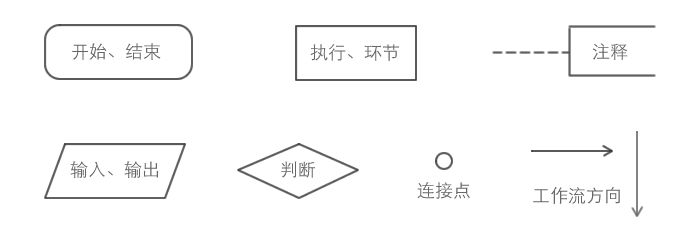
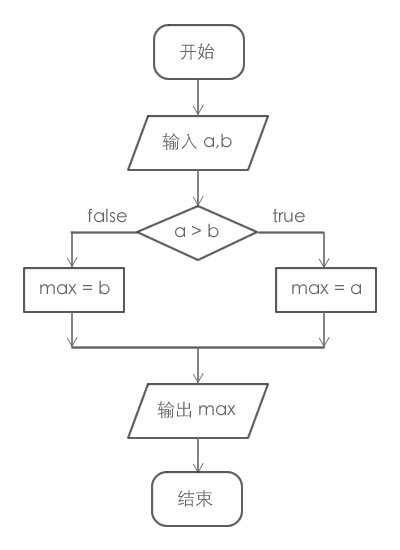

# 什么是流程图
非常专业的解释：以特定的图形符号加上说明，表示算法的图，称之为**流程图**或者**框图**。
很多人，包括工程师们都不会画出真正的流程图，流程图对于开发人员来说是必需要懂的，在进行复杂逻辑的编写前需要清晰的画出流程图来对程序做一些预判，当然流程图也可以拿来做沟通，让大家能够很容易直观的了解整个业务流程。

## 图形符号
如何画好或者读懂流程图，必需先了解每个符号表示什么意思：

* 开始与结束，用圆角矩形表示；
* 某个行动方案、普通工作环节，用矩形表示；
* 判定或者判断环节，用菱形表示；
* 输出和输入，用平行四边形表示；
* 工作流方向，用箭头表示；
* 连接点，用圆形表示；

## 一个完整的流程图
下图为一个完成的流程图：

从流程图可以直观的看出来它的整个逻辑。

## 流程图工具
* Word
* ProcessOn

