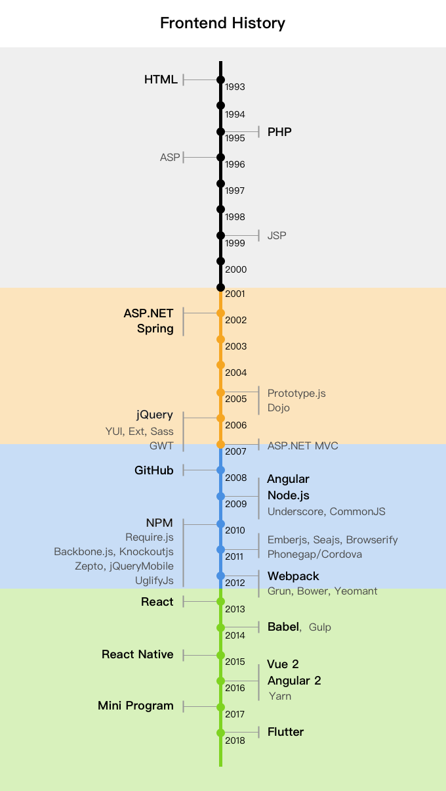

# 前端简史
1990 年*蒂姆·伯纳斯·李*（Tim Berners-Lee）在欧洲粒子物理实验室里开发出了世界上第一个网页浏览器，从此互联网时代来临，前端技术也随之不断发展。在长达 40 年的互联网时代，前端技术从简单的文本信息，发展到现在丰富多样的信息时代，到底经历了什么样的技术变革呢？我们解决呢什么问题呢？它为什么会这样变化？它的未来有是如何呢？这些都是值得我们去思考的问题，让我们重返历史，和了不起的科学家、工程师们一起来体验技术的变革。

在整个前端发展过程中，我们一直在解决这三个问题：工程化、性能、跨平台。

## 计算机起源
互联网的出现离不开计算机技术的出现，100多年前*约瑟夫·亨利*发明的继电器也许就是计算机的最早雏形，就在人类的启蒙时代人们用理性的思考改变这时代的变迁，*摩尔斯*在1839年将信息以电波的形式发送到远方时，已经奠定了现在通讯的基础。1854年*布尔*用布尔代数的方式将人类的思维用数学的方式表达出来，1和0成为了计算机中最小单位。*查尔斯·桑德斯·皮尔士*通过电子管将电和布尔代数结合起来，预示着计算机开始孕育。纵观历史长河，计算机未出生前就尽力了长达 70 多年的孕育，其中有各种不同的科学家重要的贡献。直到1946年*约翰·冯·诺依曼*为军方制造出计算弹道的 ENIAC，计算机从此诞生。

* 继电器（约瑟夫·亨利，1830年8月）
* 电磁感应（法拉第，1831年10月17日）
* 电（特斯拉）
* 摩尔斯电码（摩尔斯，1839年）
* 布尔代数（布尔）
    * 与或非
* 逻辑门（查尔斯·桑德斯·皮尔士，1886）
    * 电子管（真空管）（李‧福勒斯特，1907）
    * 晶体管
* 二进制
    * 里德·所罗门码
* 加法器
* ENIAC（约翰·冯·诺依曼，1946年2月）

## 互联网起源
有了计算机还不能构成网络，互联网的鼻祖阿帕网也是经历了长达20年的历史，通过众多计算机专家、科学家以及工程师的努力才完成，当时阿帕网是冷战孕育的产物，还没有民用起来。1993*蒂姆·伯纳斯·李*发明了第一个网页浏览器，此刻互联网时代拉开序幕。

* ARPANET（阿帕网，美国国防部高级研究计划管理局）1969-1990
    * 人工智能专家：约瑟夫·利克莱德
    * 鲍勃·泰勒
    * 拉里·罗伯茨（《资源共享的电脑网络》）
    * 雷纳德·克兰罗克（《通讯网络》）
    * 道格拉斯·恩格尔巴特（鼠标发明者）
    * 伊凡·苏泽兰（计算机图形学之父，虚拟现实之父）
    * 温顿·瑟夫和鲍勃·卡恩（TCP/IP 协议）（NCP 协议1982 停用）
* WWW 万维网（World-Wide Web）1991
    * 蒂姆·伯纳斯·李 HTTP 协议，第一个网页浏览器：http://info.cern.ch/

## 前端简史
下面是20多年的前端技术发展轨迹，当然还有很多很多没有标注在时间线上（未来会整理一份更加想尽的时间线），每个时代都有自己的特征，当然互联网技术的发展也依靠商业模式的发展，众多工程师的努力，让我们跨越历史，看看前端几乎的发展：

### 混沌时代
在互联网发展初期，无论是互联网产品和基于互联网的商业模型都没有出现，它对人们来说非常非常新鲜，只有少数人基于它做一些开发，个人网页是或许是初期的应用形态，PHP 作为最古老的互联网开发工具，至今为止也有很多公司和个人在使用。当然作为互联网这个新鲜而又充满想象的境地，各大计算机行业具体也嗅到了它的味道，微软公司率先推出了 ASP，之后的3年 Sun 公司也推出了 JSP。当时的产品和商业模式并不成熟，业务也不复杂，前端代码和后端代码没有清晰的界限，作为网页工程师，他们在页面上链接数据库，在页面上组合 HTML，在页面上写 JS 交互，前后端比清晰，处于混沌状态。作为互联网发展初期，人们可以跨越千里，看到他人或公司的介绍网站，这已经是非常神奇的事情了。

* 1993 HTML
* 1995 PHP (Personal Home Page Tools)
* 1996 ASP
* 1999 JSP

### 混合时代
随着时间的发展，人们希望通过互联网获更快的获取到更多的信息，此时搜索引擎和门户网站的出现让互联网成为一个可以赚钱的时代，适合互联网的商业模式也开始得到逐步证明。个人网站、公司企业网站越来越多业务也越来越复杂，为了解决工程的复杂度，微软公司和SUN公司先后用各自 MVC 模式将试图层和逻辑层解藕出来，前端也逐步开始形成，jQuery 的出现让前端开发更加的容易，它提供了整套的工具来解决 HTML 的操作。商家为了吸引人们的眼球，网站的表现形式开始从单纯的文字图片变得和用户更有交互，富客户端也逐步开始。

* 2002 asp.net
* 2002 spring
* spring mvc
* 2005 prototype.js
* 2005 dojo
* 2006 jQuery
* 2006 yui
* 2006 ext
* 2006 sass/scss
* 2006 gwt
* 2007 .net mvc

### 前端分离时代（移动互联网）
2007 年乔布斯将 iPhone 展示给众人，移动互联网带来了巨大商机，各大商家纷纷转战移动端，丰富多样的 APP&H5 让用户随时随地获取到各种信息，和远在万里的人们沟通交流，也能通过发达的物流得到自己想要的事物，世界越来越小，人们的距离越来越近。为了完成复杂的交互逻辑，互联网前端技术也彻底的从后端分离开来。以 Google 为首的 Angular 前端 MVVM 框架，让复杂的前端逻辑更加容易开发，在借助各个自发组织和互联网公司研发出来的构建工具，让前端越来越工程化，越来越能够应付更加复杂的业务逻辑。这个时代出现过很多优秀的前端框架，它们让前端丰富多彩。

* 2008 github
* 2009 less
* 2009 angular
* 2009 underscore
* 2009 commonJS
* 2009 node.js
* 2010 npm
* 2010 requirejs
* 2010 backbone.js
* 2010 knockoutjs
* 2010 stylus
* 2010 three.js
* 2010 zepto (2016)
* 2010 jquerymobile
* 2010 uglifyjs
* 2011 d3.js
* 2011 emberjs
* 2011 seajs
* 2011 browserify
* 2011 phonegap/cordova
* 2012 bower
* 2012 yeoman
* 2012 grunt

### 前后端融合时代
移动互联网继续蓬勃发展，大型手游、共享经济、视频社交各种应用层出不穷，但是大家同样面临这一个问题，跨平台，web、iOS、Android等不同终端，导致开发团队异常的冗余，为了适应各端开发成本成倍提高，当然之前已经有过 Hybrid 的方式来解决此问题，但是还是不够彻底。以 Facebook 为首推出 React Native 通过 Web 的方式开发 App，另外 Vue2、Angular2 借助于 Nodejs 解决了 SSR 让前后端慢慢融合，从前端 APP、WEB 到服务端全用统一语言或者框架来解决，让开发成本随之降低起来。当然 Google 也是嗅到了跨平台的未来，今年出来搞事情，推出重量级产品 Flutter 用另一种不同的方式来解决跨平台，从此前后端融合的跨平台时代即将到来。

* 2012 webpack
* 2013 react
    * 2016 next
* 2014 gulp
* 2014 babel
* 2015 react native
* 2016 yarn
* 2016 angular2
* 2016 vue2
    * 2016 nuxt
* 2017 mini program
* 2018 flutter

## 最后
两年前定下的目标 100 篇技术文章，用《前端简史》结束，当然也是另一个目标的开始，技术还会继续发展还会继续进步，前端技术的未来是什么呢？这也是值得思考的事情......