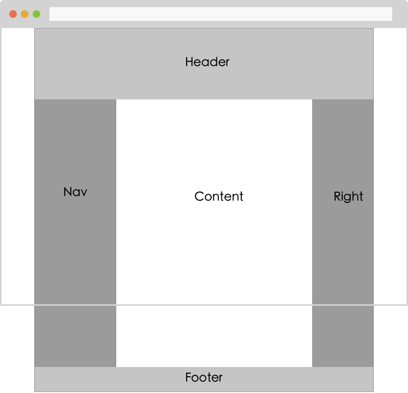
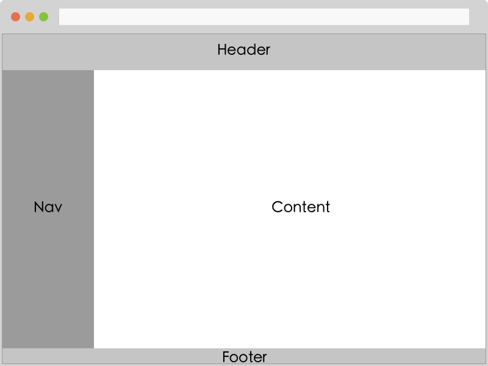
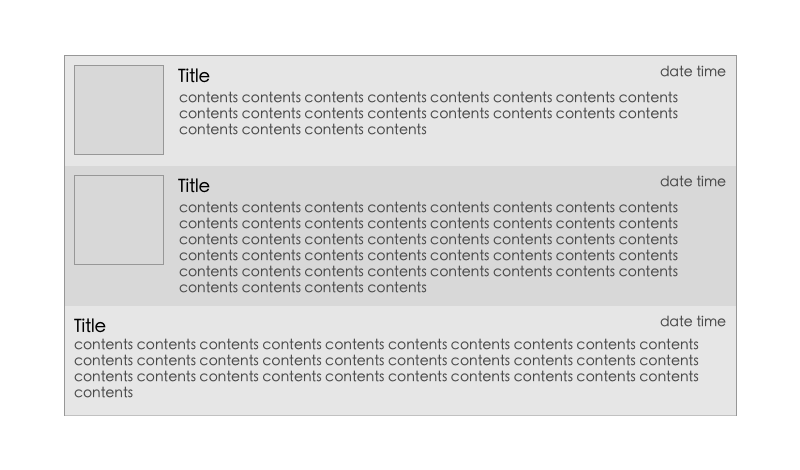
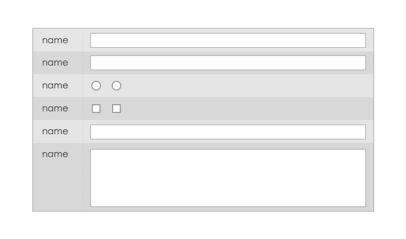

# 布局
布局在前端开发中非常重要，布局是骨架是结构，犹如房子的地基框架，设计优良的结构对整个页面的可维护性和扩展性都有很好的帮助。网页的样式可以变化多端，但是万变不离其宗，我们总结一下网页布局有哪些？他们如何设计比较合理。

## 经典布局
页面的经典布局如下图，它非常实用并且经久不衰，很多新的布局也是基于这种布局演变出来。



我们看看它的一些特点：
* 三列布局，中间宽度自适应，两边固定宽度；
* 整体水平居中；
* 整体宽度可以任意调整；
* 允许任意列的高度最高；

HTML：

```
todo...
```

CSS：

```
todo...
```

## 管理界面布局
管理界面的布局可以说是经典布局的一个演变：



* 三列或两列，中间宽度自适应，两边固定宽度；
* 整体宽度 100%；
* 整体高度相对浏览器可是区域 100%；
* 中间区域有滚动条；

HTML：

```
todo...
```

CSS：

```
todo...
```

## 列表布局
列表的布局数据局部布局，但是也是一个非常常用的布局方式。



* 整体宽度自适应；
* 每一列高度大于某一高度后自动变高；
* 左边可能有封面图或者 icon，宽度固定；

HTML：

```
todo...
```

CSS：

```
todo...
```

## 表单布局
表单布局非常常见：



* 两列布局，左边固定右边自适应；
* 整体宽度自适应；
* 左边是表单项的名称，右边是表单输入项；
* 表单输入项内部的输入空间分情况占满输入项列；

HTML：

```
todo...
```

CSS：

```
todo...
```

## 手风琴布局

