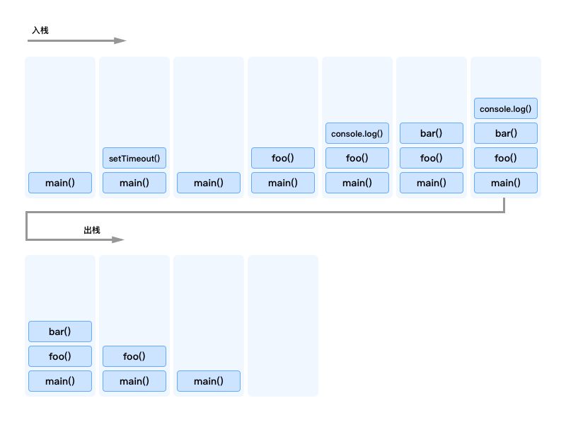
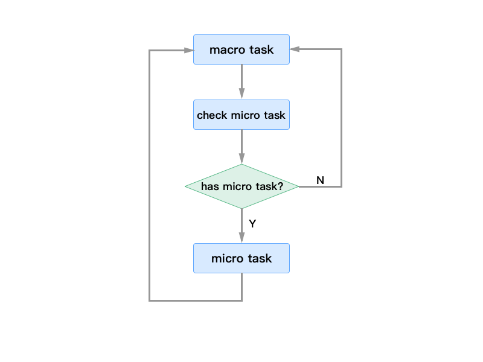

# Event Loop
JavaScript 代码的运行机制，主要依靠 Event Loop（事件循环）来实现的，在弄清楚整个机制之前，我们先要了解如下概念：

* single-thread（单线程）
* heap（堆内存）
* stack（栈内存）
* gc（垃圾回收）
* timers（定时器）
* 任务队列
    * macro-task or Task（宏任务）
    * micro-task or Job（微任务）

## 一些概念

### single-thread（单线程）
众所周知，一个正在运行的程序至少有一个进程，当然大多数情况下一个程序会开启一个进程，每一个进程都有它们自己的地址空间，计算机会给它分配一定的内存空间（堆内存、栈内存），也会给予它一些 CPU 计算资源，通俗的讲：“进程就是执行中的程序”。那么，计算机资源本身是有限的，如何才能合理的利用这些资源呢，那么又引出了线程的概念，一个进程会管理至少一个线程，通过对线程的合理调度，来达到高效合理的共同完成多件事情，这就是多线程。

那么只有一个线程的程序就是单线程了。那么从理论上来说，多线程肯定是比单线程更加的高效，为什么 JavaScript 要设计成单线程的呢？我们先看看多线程和单线程的优缺点：

* 多线程
    * 优点：充分利用 CPU 资源，提高效率。
    * 缺点：增加了更多的消耗（线程调度管理等）；增加了复杂度用来保证线程之间同步。
* 单线程
    * 优点：开销小；复杂度低；资源共享性好。
    * 缺点：一个线程崩溃，整个程序崩溃；

我相信任何一个语言或者框架的设计者，都会去做相应的平衡，并不是只有1和0之分，我们从引用场景来讲，单线程也好多线程也罢，其实都是可以做到的，或许这也是设计者的偏好吧。

### heap（堆内存）
程序中（JavaScript）声明的引用类型（例如：Object、Array、Function）都存放在堆中。它遵循先进先出原则，由系统自动分配和释放。

### stack（栈内存）
程序中声明的基本类型（例如：Boolean、Number、String、Undefined、Null），以及主程序函数的执行，都存储在栈中。它遵循先进后出原则，由程序本身来分配和释放。

我们来看看下面这段代码：

```
function bar() {
    console.log(1);
}

function foo() {
    console.log(2);
    bar();
}

setTimeout(() => {
    console.log(3)
});

foo();
```



* 入栈
    * main()
    * main()-setTimeout() // setTimeout 为异步任务，会将 console.log(3) 放入任务队列后，立即出栈
    * main()
    * main()-foo()
    * main()-foo()-console.log(2) // console.log(2) 内部没有调用任何函数，执行完后，立即出栈
    * main()-foo()-bar()
    * main()-foo()-bar()-console.log(1)
* 出栈
    * main()-foo()-bar()
    * main()-foo()
    * main()
    * 
* 栈内没有任何内容，此时可以获取任务队列中的任务
    * main()
    * main()-console.log(3)
    * main()

### gc（垃圾回收）
JavaScript 中的垃圾回收机制大概有两种：标记清除法和引用计数法。

标记清除法：函数中会声明很多变量，当函数进入执行环境时，垃圾回收器将这些变量标记为“进入环境”，当函数执行结束后，这些变量会被标记为“离开环境”，垃圾回收器会定期销毁并回收这些标记为“离开环境”变量所占有的内存空间。

```
function foo(){
    var x = 1; // 进入环境
    var y = 2; // 进入环境
}
foo(); // 执行完毕之后 x、y 被标 “离开环境”，将会被回收
```

引用计数法：它会跟踪每个变量的引用次数，如果该变量被引用一次，那么它的引用次数会被加 1；相反，当引用了该变量的变量，取得了另外一个值，此时该变量的引用被减 1。在反复的加减中，变量被引用的计数会变为 0，此刻说明这个值已经无法访问了，它将会被垃圾回收器销毁并回收。不过这种方式会出现问题：

```
function foo() {
    var x = {}; // x 引用： 0
    var y = x;  // x 引用： 1
    var z = x;  // x 引用： 2
    var y = {}; // x 引用： 1
}
```

上面的例子中，x 最后引用计数为 1，它将永远不会被销毁。

### timers（定时器）
TODO...

### 任务队列
前面说过 JavaScript 是单线程的，它是如何去处理这些异步任务和事件呢？主线程执行的时候，当它发现一个异步任务时，会将该任务放入一个任务队列中，当主线程完成当前任务后，才会从任务队列中获取新任务一个一个执行。当然任务队列分两种：

* macro-task: script（整体代码）, setTimeout, setInterval, setImmediate, I/O, UI rendering
* micro-task: process.nextTick, Promises（这里指浏览器实现的原生 Promise）,Object.observe, MutationObserver

## Event Loop
有了上面的概念后，我们再来了解事件循环。在 JavaScript 单线程的设计中，又如何做到一些事件、异步调用、网络请求、io 读取等各种不同的任务操作并且不影响性能的呢？这就由任务队列来管理这么多不同的任务，不同任务队列之间的工作流程和关系，形成了 Event Loop（事件循环）。

前面我们说过宏任务和微任务，任务执行过程如下图：



* 主程序在宏任务队列中，Javascript 引擎会先执行宏任务
* 当宏任务执行结束后，再检查微任务队列是否有任务可以执行
    * 如果没有，继续执行下一个宏任务
* 如果有，会完成微任务队列中的所有任务

上面描述的仅仅是宏任务和微任务的执行流程，那么我们纵观整个程序在计算机中的运行过程：


* Javascript 环境会将主程序的任务逐个压入内存栈中，并执行程序；
* 当内存栈中的任务遇到异步操作时，会调用浏览器API，将任务放入相应的任务队列中；
* Event loop 会分配不同队列中的任务，将他们压入内存栈中执行；
* 不断的反复进行上述 3 步；

这样一来，就形成了 Javascript 整个环境的 Event loop。


## 参考：
* https://juejin.im/post/5bfe581ee51d454af013baf3
* https://blog.csdn.net/lc237423551/article/details/79902106
* https://segmentfault.com/a/1190000011198232
* https://blog.csdn.net/eeewwwddd/article/details/80862682
* https://juejin.im/post/59e85eebf265da430d571f89
* https://vimeo.com/96425312
* https://blog.csdn.net/weixin_42420703/article/details/82790942
* https://www.youtube.com/watch?v=cCOL7MC4Pl0
* https://www.cnblogs.com/yzg1/p/7514514.html
* https://mp.weixin.qq.com/s/qJSmotjzeu02EeK51NgFUQ?
* http://www.cnblogs.com/heioray/p/9487093.html
* http://jafeney.com/2016/01/10/2016-01-10-js/
* https://blog.risingstack.com/node-hero-async-programming-in-node-js/