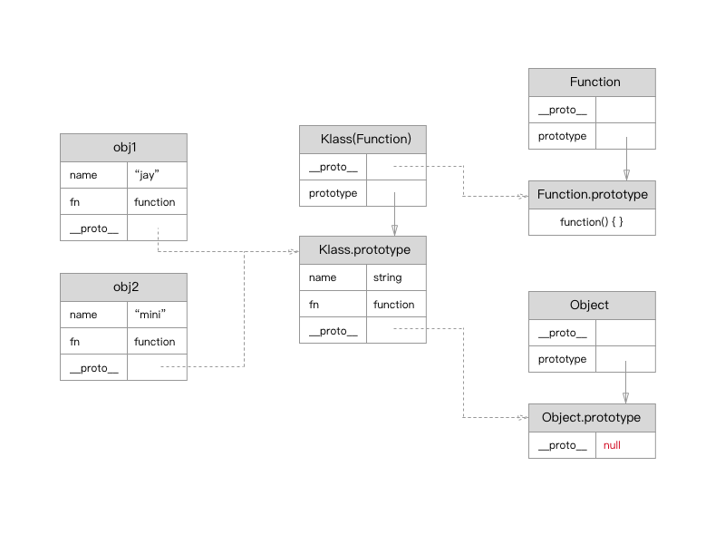

# 原型
原型，是 JavaScript 语言中的非常重要的设计，它也是非常难以理解的，再加上原型一层嵌套一层，最终形成一个复杂的原型链，更佳让人琢磨不透。原型是一种对象创建型设计模式，通过克隆的方式来创建对象。

## prototype
`prototype`并非对象的原型，它是构造函数的原型，也就是说只有`function`才有`prototype`属性。附着在`prototype`下的成员将原封不动的克隆到该类型对应的对象中，但是它并不会覆盖函数体内的同名方法。

```
var klass = function() {
	this.name = "jay";
	this.fn = function() {
		console.log("It's a function");
	}
}
klass.prototype.fn = function(){
	console.log("It's a prototype function");
};
klass.prototype.age = 4;

var obj = new klass();
console.log(obj.name + obj.age);
obj.fn();

//> Console:
//> jay4
//> It's a function
```

## __proto__
在 JavaScript 中，所有的对象都有原型`__proto__`，它是不可操作。

```
var klass = function() {
	this.name = "jay";
}
var obj = new klass();

console.log(obj.__proto__);
console.log(obj.prototype);

//> Console:
//> Object {name: "jay"}
//> undefined
```

## 原型链
`prototype` 和 `__proto__` 的关系相当复杂，`prototype`为构造函数原型，`__proto__`为对象的原型，这样一来它两的指向是一致的。所有构造函数的`__proto__`都指向`Function.prototype`;`Function.prototype`的原型指向`Object.prototype`，而 `Object.prototype`的原型为空`null`，这样就构成了一条复杂的原型链。

```
var klass = function() {
	this.name = "jay";
}
var obj = new klass();

console.log(obj.__proto__ === klass.prototype);
console.log(klass.prototype.__proto__ === Object.prototype);
console.log(Object.prototype.__proto__ === null);

console.log(klass.constructor.__proto__ === Function.prototype);
console.log(Function.prototype.__proto__ === Object.prototype);
console.log(Object.prototype.__proto__ === null);

//> Console:
//> true
//> true
//> true
//> true
//> true
//> true
```



