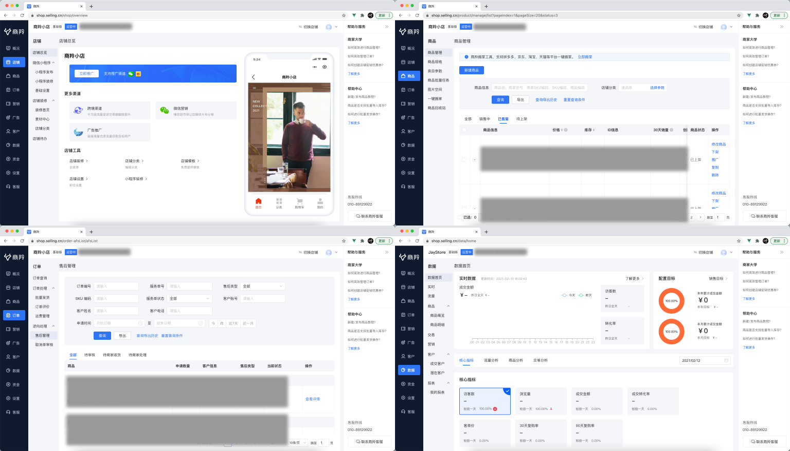

# 微前端技术在商羚商户端的实战
商羚 SaaS 商城项目，依托京东核心电商技术与数据能力，帮助中小商家极速打造微商城、小程序商城，实现多渠道营销，精准广告投放，私域流量营销，入驻顶级海外电商平台，助力中小企业数智化转型。这是一款以流量渠道为核心、商业能力为抓手、技术与服务驱动的零售经营与增长的 SaaS 化综合解决方案。商羚商家端业务和交互也是非常的复杂，前端应用数量非常庞大，参与开发的团队也是非常多，我们需要寻求一种好的前端架构方案来支撑这一系统，微前端技术运用而生。

## 一、什么是微前端
借助 [Michael Geers](https://geers.tv/) 的一篇文章[《Micro Frontends》](https://micro-frontends.org/)所说：微前端是一种技术手段和策略，它可以让众多团队构建出独立开发、独立部署现代化 Web 应用。

微前端的设计理念：
* 与技术栈无关；
* 中心化路由；
* 独立开发、独立部署；
* 简单接入；
* 一致的开发体验；

## 二、为什么要用微前端
当拿到商羚这个项目时，我就在思考一个问题，如此庞大的系统，我们到底通过什么方式来让各个系统能够拆分开来，独立开发，独立运行，又能够无缝的融合在一个页面上展示出来。或许需要在系统建设的技术难度和用户体验上做平衡......

### 不同方案对比

| 对比    | iFrame  | 公共组件（NPM） | 微前端 |
| :----- | :----- |:----- |:----- |
| 技术难度  | 容易 | 中等 | 困难 |
| 用户体验  | 差 | 中 | 好 |
| 开发体验  | 好 | 差 | 好 |
| 接入成本  | 好 | 中 | 好 |
| 融合度  | 差 | 中 | 好 |
| 升级成本  | 好 | 差 | 好 |

**融合度：主应用和子应用，以及各个子应用之间融合程度，它们 CSS、JavaScript 以及 DOM 之间的融合**

`iFrame` 虽然说技术难度低并且可靠度高，但是在体验上有致命的问题，这个方案被作为最后的选择；把各个拆分的项目引用公共头、尾和导航组件看似一个较好的解决方案，但是当公共组件一旦升级，往往各个拆分项目都要重新升级并上线，开发体验和升级成本大打折扣。微前端的确是一个可行并且体验够好的方案。

## 三、微前端基本原理
微前端分主应用和子应用，主应用主要是负责整个布局、注册子应用以及路由管理；子应用主要是按照业务拆分的独立的单页应用。

### 3.1 运行原理
微前端运行过程：
* 浏览器访问主应用；
* 主应用注册子应用；
* 启动主应用；
* 加载子应用；
* 解析子应用；
* 加载子应用资源；
* 创建沙箱环境；
* 挂载子应用；
* 预加载其它子应用资源；

### 3.2 路由规则
由于微前端的子应用会在一级路由下被激活，激活后的路由将被对应的子应用框架接管。另外还要配合商羚左侧菜单的“点亮”功能，通过当前 `URL` 路径的解析是简单有效的。我们最终约定了一个简单的路由规则：
* 每个子应用，对应一个业务模块，对应一级路由；
* 减少菜单层级，次级菜单都打平二级菜单；
* 子应用的相关页面（例如：订单查询有列表和详情），对应相同的二级路由；

### 3.3 应用隔离
应用之间的隔离，是实现微前端核心的能力，前端应用隔离主要是两个方面，CSS 样式的隔离和 JavaScript 之间的隔离。

#### CSS 样式隔离
我们采用了以下两个方案：
* 样式约定 + 工程化；
* `Shadow DOM`；

样式约定 + 工程化，这种方案非常简单可靠，各个子应用都约定自己的特有前缀，然后通过前端工程化工具 Webpack，在编译期对整体项目的样式做统一前缀处理。这种方案可以说是非常有效，并且比较好操作的方案，技术难度低，团队都能接受。

`Shadow DOM`，这种方案可以说是完全彻底的解决了样式隔离，它通过游离在 DOM 树之外的 `Shadow DOM`，完全将 DOM 和 CSS 隔离开来，商羚现在使用的微前端框架本身就自带这一功能，但是由于浏览器兼容性问题，它是否可靠还有待进一步验证。

#### JavaScript 沙箱隔离
JavaScript 沙箱的实现方案有很多例如：`eval`、`new Function`、`Proxy` 等等，关于沙箱的实现我们可以专门找一个时间好好讲讲。在框架中，采用的是 ES6 的新特性 `Proxy` 实现的，当框架检测到浏览器不支持 `Proxy` 时，会降级到快照沙箱。

代理沙箱（`ProxySandbox`），通过 `ES6` 的 `Proxy` 特性，对 `window`（全局环境） 的操作做记录，当子应用离开时我们把记录好的内容从 `window` 上卸载掉即可。快照沙箱（`SnapshotSandbox`），当浏览器不支持 `Proxy` 时，会启用快照沙箱，它会对将当前环境和原有环境进行对比，然后全量的恢复到原有环境，这种方式的缺点在于无法支持多个实例。

### 3.4 应用之间通讯
应用之间的通讯是必不可少的，主应用传递数据到子应用、子应用之间的数据传递，无非采用事件的方式来解决。

其实浏览器自带有 `CustomEvent` ，它采用`发布/订阅模式`的设计，我们可以通过它创建一个自定义事件、监听事件并触发这个事件，达到应用之间的数据通讯。框架已经为我们准备好了基于 `props` 的通讯方式（类似于 React 中组件间通信的方案），主应用和子应用之间可以通过设置和监听全局状态，来相互传递信息。比较两种方式：
* `CustomEvent`：原生支持，与框架松耦合；但是整体缺乏管理，应用之间事件名称会有冲突。
* `initGlobalState`：通讯能力完全自定义；但是只能做到主、子应用之间的直接通讯。

### 3.5 版本管理
针对每次上线版本更新，我们从两个方面上保证用户能够使用到最新版本的子应用：

* 通过工程化方式，让 JavaScript、CSS 资源文件每次更新文件名称会自动重命名，保持最新版本。
* 通过 Nginx 让每次 HTML 模版的缓存失效，保持最新版本。

我们通过对静态资源文件 Hash，从而检测到静态资源文件的变化，将文件名称变成 Hash 值，这样静态资源文件既能保持缓存、又能清除缓存。另外在 Nginx 上对模版 HTML 做了缓存清除，当然这种方式比较暴力，但模版本身体积不大，性能上也能容忍。其实最好的方式是通过配置：`Last-Modified`或者`E-Tag`来解决。

### 3.6 性能
微前端从本质上讲是一个 Web 应用，它仍然遵从 Web 前端性能优化的规则，无非就是：减小传输、打包传输、合理的加载顺序、利用缓存、网络层优化等等。

*Preload 技术在微前端项目中优势尤为明显，微前端有很多子应用，它在网络空闲时间为微前端预先加载好子应用的静态资源，再加上 HTTP2.0 的多路复用加持，并行下载能力大大加强。当用户要使用到某个子应用时，资源已经准保好，不用下载，性能得到极大提升*

### 3.7 总结一下技术
微前端通过异步的加载子应用，并且解析子应用的 HTML 模版，将其资源文件运行于同一个页面，通过对 JavaScript 和 样式的隔离，将各个子应用独立运行互不干扰。应用之间可以选择多种方式进行通讯，达到数据的传递和同步，借助工程化和 HTTP 的资源缓存特点让应用保持最新版本。性能方面也是遵从 Web 前端性能优化准则，同时拥有简单的接入方式。从技术层面上讲，微前端在大型前端项目中，是值得尝试的。

## 四、沉浸式体验
多个应用之间的沉浸式体验，是微前端技术的巨大优势，虽然说微前端主张的与框架无关，但是我们还是需要在接入时给定一些规则，例如：UI 框架、路由规则、交互规则，这样可以让微前端的体验保持更好的一致性。虽然子应用自身部署在不同的服务器、拥有不同的域名、子应用也能够独立运行，但是它能够让各个子应用无缝的融合到同一个页面。商羚商家端内贸+外贸拥有多达 20 个前端系统，他们由不同团队开发，分布在不同的服务器和域名，最终给产品带来的是体验是：它们就在一个页面，只有一个域名：https://shop.selling.cn/ 。

## 五、协同高效
微前端架构，让主应用的拥有较强的扩展性，增加新的模块和页面，可以是我们自己、也可以是任意一个其它团队开、甚至是外部团队发出来的应用。商羚项目中，我们和成都团队的内贸售后、数据模块以及整个外贸部分，都是用微前端方式进行接入的，整个测试环境的联调只用了短短两天时间。

微前端在项目协同上，能够做到：
* 多个团队、独立开发。
* 独立部署、独立运行。
* 多个应用、无缝融合。

## 六、问题和挑战
微前端还是存在一些不足之处，当然框架本来就不能权衡所有问题，它是一个不断演变和发展的过程。

* 多个子应用使用自己的技术栈，会导致浏览器加载很多框架和重复的代码，性能上由一定的影响。
* 微前端让前端环境变得更加复杂了，开发调试过程难度提升。
* 对于小型的项目，微前端优势不明显。

## 七、未来
微前端技术虽然已经在商羚商家端完成落地，但是还有很多值得改进的地方：

* 子应用公共组件抽离：
  子应用的公共组件和框架把它们抽离出来，在整个前端资源体积上会大大减少，性能也会随之优化。
* 子应用可管理，随时添加：
  未来如果子应用可以通过管理系统随时增加减少，不用上线，保证系统可运维、可管理。
* 菜单路由前端缓存：
  系统菜单数据做前端缓存是非常必要的，即便是菜单服务有问题，我们可以从缓存拿出数据保证高可用。
* 商羚微前端脚手架：
  为了能让更多第三方快速接入，我们需要一个开箱即用的微前端脚手架。
* 灰度发布：
  微前端灰度发布让上线过程更加的平滑、优雅，减少上线过程导致的业务问题。
* 低代码开发：
  未来我们希望在商羚微前端架构下开发一些常用功能，能够做到简单配置就能完成。

## 再搞点事情（One more thing）
商羚项目是一个正在茁壮成长的项目，我们从 0 到 1 用了短短不到三个月时间，技术团队也是做出了巨大的贡献。随着业务的增长，技术也需要不断的提高，也需要吸纳有想法、有能力的技术人才，所以欢迎你的加入，无论是前端还是后端，我们需要你！简历投递：tech-selling@jd.com

