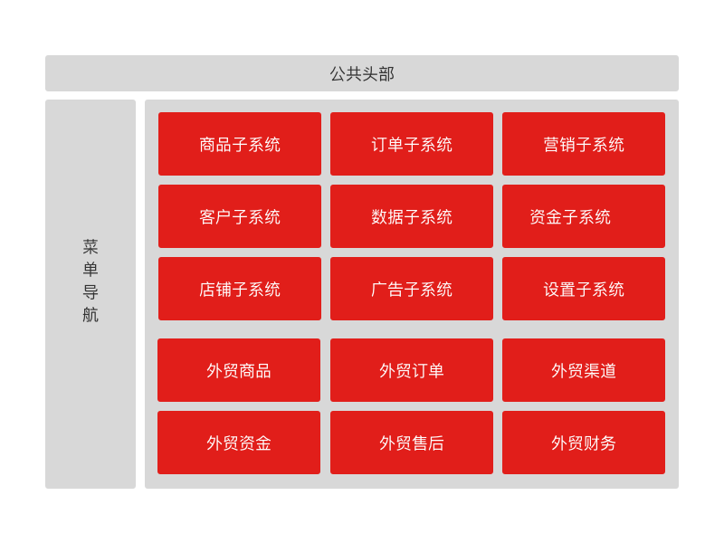
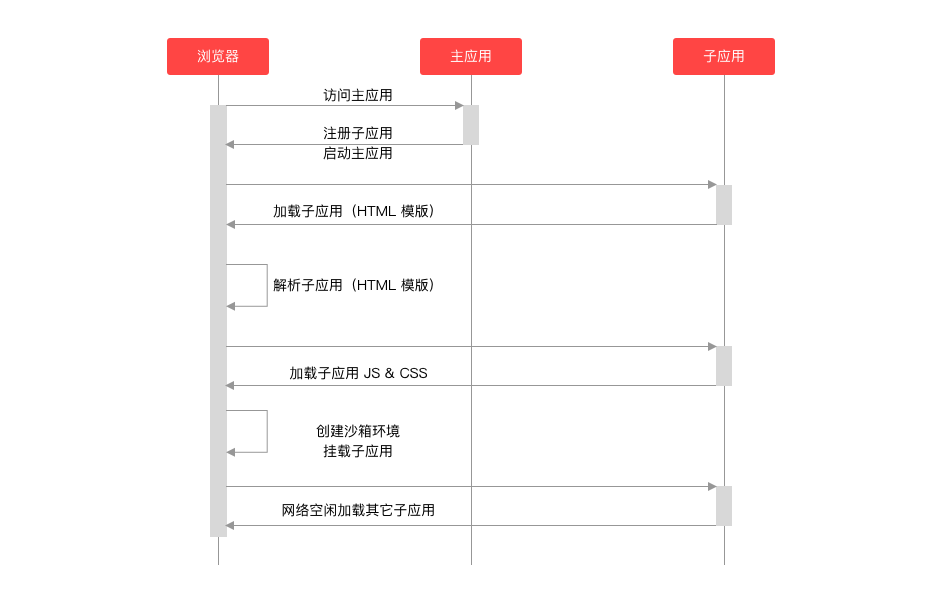
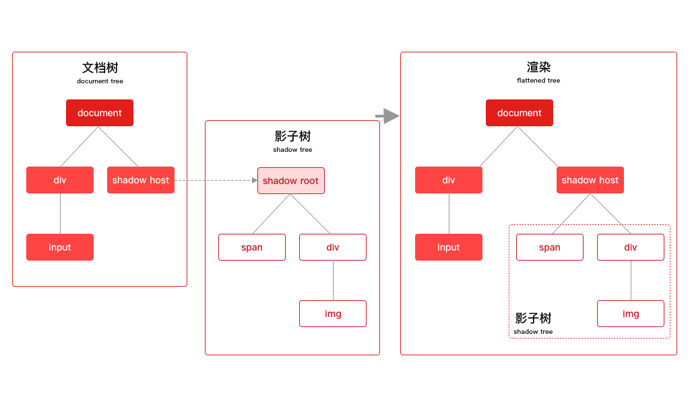

# 微前端技术在商羚商户端的运用
Web 应用从前后端混合时代，到前后端分离时代，前端不仅业务越来越繁多并且交互越来越复杂，前端应用也越来越庞大，参与开发的团队也越来越多。前端应用的拆分是必经之路，我们有很多方案去拆分，通过服务端路由分发（`Nginx`）、`iFrame`、公共组件的引用等等，它们各有优缺点，我们需要在技术难度和用户体验上做出决策。好在极客们永远不会妥协，微前端技术应用而生。

这篇文章您将了解：
* 一、什么是微前端
* 二、为什么要用微前端
* 三、微前端基本原理
  * 运行原理
  * 路由规则
  * 应用隔离
  * 应用之间通讯
  * 版本管理
  * 性能
  * 如何集成接入
* 四、沉浸式体验
* 五、协同高效
* 六、问题和挑战
* 七、未来

## 一、什么是微前端
借助 [Michael Geers](https://geers.tv/) 的一篇文章[《Micro Frontends》](https://micro-frontends.org/)所说：微前端是一种技术手段和策略，它可以让众多团队构建出独立开发、独立部署现代化 Web 应用。

> Techniques, strategies and recipes for building a modern web app with multiple teams that can ship features independently.

微前端的设计理念：
* 与技术栈无关：
  微前端的接入不限制技术栈，无论是 `Vue`、`React` 还是 `Angular` 甚至是古老的 `jQuery` 都是可以完美融合；
* 中心化路由：
  主应用统一注册子应用，统一管理各个子应用的路由；
* 独立开发、独立部署：
  子应用独立仓库、独立开发、独立部署，同时主应用会将各个子应用融合带一起；
* 简单接入：
  子应用只需要简单改造就能够接入，就像古老而又可靠的 `iFrame` 接入方式一样；
* 一致的开发体验：
  开发者在微前端下开发子应用，和平时开发其它 Web 应用没有太大区别，没有因为是微前端架构而做过多的特殊处理；

微前端并不是单单技术上的创新，它在团队协同、用户体验上都给我们带来非常大的提升，它借鉴了微服务的概念，在技术架构上它能够做到各个系统模块的拆分，既能让模块之间低耦合，又能让所有的模块聚合到同一个页面上运行。

## 二、为什么要用微前端
当拿到商羚这个项目时，我就在思考一个问题，如此庞大的系统，我们到底通过什么方式来让各个系统能够拆分开来，独立开发，独立运行，又能够无缝的融合在一个页面上展示出来。或许需要在系统建设的技术难度和用户体验上做平衡......



### 不同方案对比

| 对比    | iFrame  | 公共组件（NPM） | 微前端 |
| :----- | :----- |:----- |:----- |
| 难度  | 好（低） | 中 | 差（难） |
| 体验  | 差 | 中 | 好 |
| 融合度  | 差 | 中 | 好 |
| 健壮性  | 好 | 好 | 中 |
| 开发体验  | 好 | 差 | 好 |
| 接入成本  | 好 | 中 | 好 |
| 升级成本  | 好 | 差 | 好 |

`iFrame` 虽然说技术难度低并且可靠度高，但是在体验上有致命的问题：`iFrame` 内部弹框不能够覆盖全局、滚动条问题、`iFrame` 内页面加载过程太慢、数据统计繁琐等等，这个方案被作为最后的选择；把各个拆分的项目引用公共头、尾和导航组件看似一个较好的解决方案，但是当公共组件一旦升级，往往各个拆分项目都要重新升级并上线，开发体验和升级成本大打折扣，同时它也会因为各个项目不及时更新而导致项目之间跳转后体验不一致的现象。

当我对技术难度、体验、升级成本等各个纬度的调研后发现，微前端的确是一个可行并且体验够好的方案，但是面对技术难度上来说的确是一个巨大的挑战。使用它你能得到一个非常好的用户体验和团队协作的提升，但是另一个需要权衡的是这种技术的可靠性，以及团队对新技术的容忍度。还好我们的前端团队是一个年轻有好奇心的团队，我们选择了挑战，做好了降级到 `iFrame` 的方案，最终选择微前端技术来完成商羚项目。

微前端框架现在用的比较多的是 `single-spa`，`single-spa` 是一个非常基础原始的框架，如果直接使用它团队还有很多事情要做。在技术框架上我们选择了 `qiankun`，它基于 `single-spa` 、与技术栈无关、接入方式简单、样式隔离、JavaScript 沙箱等特性，能够让团队在商羚项目中能够快速的运用微前端技术。


## 三、微前端基本原理
微前端分主应用和子应用，主应用主要是负责整个布局、注册子应用以及路由管理；子应用主要是按照业务拆分的独立的单页应用。


### 3.1 运行原理
微前端运行过程如下：
* 浏览器访问主应用：
  此时主应用会被下载到浏览器，并且开始运行主应用；
* 主应用注册子应用：
  设置子程序相关配置：子应用名称、子应用入口、子应用加载到哪个 `DOM`、子应用激活路径等等；
* 启动主应用；
* 加载子应用：
  浏览器会根据子应用入口下载子应用 HTML 模版；
* 解析子应用：
  框架开始解析子应用 HTML 模版，`DOM`、JavaScript 资源和 CSS 资源；
* 加载子应用资源：
  浏览器开始下载子应用 JavaScript 和 CSS 资源；
* 创建沙箱环境：
  为了将多个应用隔离开来，互不干扰，主应用为子应用创建沙箱环境；
* 挂载子应用：
  子应用开始运行。



### 3.2 路由规则
由于微前端的子应用会在一级路由下被激活，激活后的路由将被对应的子应用框架（`Vue`、`React` 或者 `Angular`）接管。另外还要配合商羚左侧菜单的“点亮”功能，这种“点亮”关系不能存储在内存中，因为浏览器刷新后内存中的数据将被清空，通过当前 `URL` 路径的解析是简单有效的。我们最终约定了一个简单的路由规则：
* 每个子应用，对应一个业务模块，对应一级路由；
* 减少菜单层级，次级菜单都打平二级菜单；
* 子应用的相关页面（例如：订单查询有列表和详情），对应相同的二级路由；


另外在商羚项目中有一些比较特殊的地方，订单模块中的售后管理是由成都独立开发独立部署的，我们通过一些扩展字端来解决这个模块并不属于订单模块，而又能够将它融合在左侧菜单中。理论上来说，我们可以设计一种通过配置的方式，来管理所有的子应用及其页面对应左侧菜单之间的关系，并且实现左侧菜单“点亮”功能，但是为了快速的完成项目，我们还是以简单快速有效的方式代替了完美的设计方案。

### 3.3 应用隔离
应用之间的隔离，是实现微前端核心的能力。多个应用采用了不同的技术栈，为了能让它们在同一个页面环境运行起来，将它们有效的隔离开来是一件非常重要的事情，否则多个应用之间会相互影响。前端应用隔离主要是两个方面，多个应用 CSS 样式的隔离和 JavaScript 之间的隔离。

#### CSS 样式隔离
样式隔离，通常有以下几个方案：
* 样式约定 + 工程化；
* `Shadow DOM`；
* Runtime css transformer；

样式约定 + 工程化，这种方案非常简单可靠，各个子应用都约定自己的特有前缀，然后通过前端工程化工具 Webpack，在编译期，整体对样式做统一前缀处理。这种方案可以说是非常有效，并且比较好操作的方案，技术难度低，团队都能接受。

`Shadow DOM`，这种方案可以说是完全彻底的解决了样式隔离，它通过游离在 DOM 树之外的 `Shadow DOM`，完全将 DOM 和 CSS 隔离开来，商羚现在使用的 `qiankun` 微前端框架本身就只带这一功能，但是由于浏览器兼容性问题，它是否可靠还有待进一步验证。



Runtime css transformer，这种通过运行时来改变当前子应用所引用的 CSS，这种方案虽然可行，但是在运行时增加、修改、删除样式，会在性能上有一定的消耗。

商羚商家端的样式隔离，为了保证性能和稳定性，我们采取了样式约定的方式来隔离各个子应用之间的样式，同样我们也开启了 `qiankun` 的 `Shadow DOM`，当然最有效和简单实施方案还是样式约定。

#### JavaScript 沙箱隔离
JavaScript 沙箱的实现方案有很多例如：`eval`、`new Function`、`Proxy` 等等，关于沙箱的实现我们可以专门找一个时间好好讲讲。在 `qiankun` 框架中，采用的是 ES6 的新特性 `Proxy` 实现的，当框架检测到浏览器不支持 `Proxy` 时，会降级到快照沙箱。

代理沙箱（`ProxySandbox`），通过 `ES6` 的 `Proxy` 特性，对 `window`（全局环境） 的截获，我们可以劫持到子应用对 `window` 上的操作，例如：增加属性、修改属性、删除等操作，然后将这些变化记录到一个公共存储中（`updateValueMap`），当子应用离开时我们把记录好的内容从 `window` 上卸载掉即可。这样一来，我们就可以在多个应用之间随意切换，并且保持应用间环境是隔离的。

快照沙箱（`SnapshotSandbox`），当浏览器不支持 `Proxy` 时，会启用快照沙箱，快照沙箱其实就是通过 `diff` 的方式，将当前环境和原有环境进行对比，然后全量的恢复到原有环境，这种方式的缺点在于无法支持多个实例。


### 3.4 应用之间通讯
应用之间的通讯是必不可少的，主应用传递数据到子应用、子应用之间的数据传递，无非采用事件的方式来解决。市面上也有很多自定义事件组件，在这种微前端架构中，我们的选择也非常多。

其实浏览器自带有 `CustomEvent` ，它采用`发布/订阅模式`的设计，我们可以通过它创建一个自定义事件、监听事件并触发这个事件，达到应用之间的数据通讯：

```js
// 创建
let event = new CustomEvent('event-a', {
  detail: 'hello'
});
// 监听
document.addEventListener('event-a', function(e){
  console.log(e.detail);
})
// 触发
document.dispatchEvent(event);
```

还在 `qiankun` 框架已经为我们准备好了基于 `props` 的通讯方式（类似于 React 中组件间通信的方案），主应用和子应用之间可以通过设置和监听全局状态，来相互传递信息。

主应用：
```js
import { initGlobalState, MicroAppStateActions } from 'qiankun';
// 初始化 state
const actions: MicroAppStateActions = initGlobalState(state);
actions.onGlobalStateChange((state, prev) => {
  // state: 变更后的状态; prev 变更前的状态
  console.log(state, prev);
});
actions.setGlobalState(state);
actions.offGlobalStateChange();
```

子应用：
```js
// 从生命周期 mount 中获取通信方法，使用方式和 master 一致
export function mount(props) {
  props.onGlobalStateChange((state, prev) => {
    // state: 变更后的状态; prev 变更前的状态
    console.log(state, prev);
  });
  props.setGlobalState(state);
}
```

在商羚商家端，我们更多的使用了 `qiankun` 框架自带 `initGlobalState` 的方式，当然使用 `CustomEvent` 也是没有太大问题，比较两种方式：
* `CustomEvent`：原生支持，与框架松耦合；但是整体缺乏管理，应用之间事件名称会有冲突。
* `initGlobalState`：通讯能力完全自定义；但是只能做到主、子应用之间的直接通讯。

### 3.5 版本管理
针对每次上线版本更新，我们从两个方面上保证用户能够使用到最新版本的子应用：

* 通过工程化方式，让 JavaScript、CSS 资源文件每次更新文件名称会自动重命名，保持最新版本。
* 通过 Nginx 让每次 HTML 模版的缓存失效，保持最新版本。

传统的静态资源上线，为了保证获取到最新的资源文件，我们都会在 HTML 模版上增加版本号来保持最新版本，例如：`<script src="https://cdn.jsdelivr.net/npm/vue@2.6.12"></script>`，但自从前端有了自动化构建工具后，我们可以通过对静态资源文件 Hash，从而检测到静态资源文件的变化，将文件名称变成 Hash 值（`<script src="/static/js/app.6dc28809.js"></script>`），这样静态资源文件既能保持缓存、又能清除缓存，最重要的是这个过程是自动化的。

从上面的运行原理，我们知道，商羚商家端的子应用入口采用 HTML 的方式，也就是说每次加载子应用的时候，首先会加载它的 HTML 模版，如果 HTML 模版不能得到及时的更新，它引用的静态资源文件也是旧的，我们在 Nginx 上对模版 HTML 做了缓存清除：`add_header Cache-Control "private, no-store, no-cache, must-revalidate, proxy-revalidate";`，当然这种方式比较暴力，但模版本身体积不大，性能上也能容忍。其实最好的方式是通过配置：`Last-Modified`或者`E-Tag`来解决。

### 3.6 性能
微前端从本质上讲是一个 Web 应用，它仍然遵从 Web 前端性能优化的规则。

#### 跑车和轿车之间的较量
问题：如果跑车是轿车速度的两倍，是跑车快还是轿车快？

* 比赛1：从起点到终点的比赛：毫无疑问跑车肯定先到达终点，秒杀轿车；
* 比赛2：将 4 个人从起点运到终点：跑车此时就比较尴尬，因为只能带 1 位乘客，而轿车可以一次带 4 位乘客，显然跑车要来回好几趟，而轿车只需要 1 趟，明显轿车的效率更高。

所以性能的优化有两种：一种是快，体现在战术上，通过极致的优化算法达到目的；一种是高效，体现在战略上，通过合理的安排资源达到目的。快就是竞技赛强者胜；而高效是团体赛谋者胜；在商羚项目中，我们做的和没做过的性能优化：

* [术]减重传输
  * 使用小 favicon.ico 文件
  * 减少 Cookie 大小
  * [x]静态资源文件使用无 Cookie 的域
  * 精简 JavaScript 和 CSS
  * 移除重复的脚本
  * 使用 Gzip 压缩
* [略]打包传输
  * [x]尽可能减少 HTTP 请求次数，合并 JavaScript 和 CSS
  * IconFont
* [略]合理的加载顺序
  * 资源文件拆分，按需加载
  * [x]图片按需加载
* [术]利用缓存
  * 使用外部 JavaScript 和 CSS 外部文件
  * 加入 Expires 或 Cache-Control Header
  * 配置 ETag
  * 缓存 AJAX
* [术]网络层
  * [x]使用 CDN
  * HTTP 2.0
  * Preload 技术

*Preload 技术在微前端项目中优势尤为明显，微前端有很多子应用，它在网络空闲时间为微前端预先加载好子应用的静态资源，再加上 HTTP2.0 的多路复用加持，并行下载能力大大加强。当用户要使用到某个子应用时，资源已经准保好，不用下载，性能得到极大提升*


### 3.7 如何集成接入
商羚商户端采用 `qiankun` 这一微前端框架，接入方式非常简单。

#### 主程序
* 安装 `qiankun` 框架：`yarn add qiankun`；
* 通过 `registerMicroApps` 注册子程序；
* 通过 `start` 启动微前端框架；
* 程序之间的跳转采用：`window.history.pushState({}, '', path)`；

``` ts
import { registerMicroApps, start } from 'qiankun';

@Component
export default class App extends Vue {
  mounted () {
    registerMicroApps([{
        name: 'module-overview',
        entry: 'https://overview.selling.cn',
        container: '#root-view',
        activeRule: '/overview',
      }, {
        name: 'module-shop',
        entry: 'https://info.selling.cn',
        container: '#root-view',
        activeRule: '/shop',
      }], // ...
      {
        beforeLoad: [
          (app) => {
            // console.log('before load', app);
            return Promise.resolve();
          }
        ],
        beforeMount: [
          (app) => {
            // console.log('before mount', app);
            return Promise.resolve();
          }
        ],
        afterUnmount: [
          (app) => {
            // console.log('after unload', app);
            return Promise.resolve();
          }
        ]
      }
    );

    start({ prefetch: true });
   }
}
```

#### 子程序
* 构建配置：`vue.config.js`
  * 配置跨域访问：`'Access-Control-Allow-Origin': '*'`
  * 打包成 umd：`libraryTarget: 'umd'`
* 创建 `public-path.js` 用于修改运行时的 publicPath；
* 程序入口文件 `main.ts` 导出微前端生命周期钩子：
  * `export async function bootstrap`
  * `export async function mount`
  * `export async function unmount`
  * `if (!window.__POWERED_BY_QIANKUN__)`
* 路由配置 `router`：
  * `base: window.__POWERED_BY_QIANKUN__ ? props.baseRoute : '/';`

`vue.config.js` 文件：
``` js
const port = 9020;
// 此处省略很多配置
module.exports = {
  outputDir: 'dist',
  assetsDir: 'static',
  filenameHashing: true,
  devServer: {
    hot: true,
    disableHostCheck: true,
    port,
    headers: {
      'Access-Control-Allow-Origin': '*'
    }
  },
  configureWebpack: {
    output: {
      // 把子应用打包成 umd 库格式
      library: `${name}-[name]`,
      libraryTarget: 'umd',
      jsonpFunction: `webpackJsonp_${ name }`,
      publicPath: '/',
      chunkFilename: 'chunk-[id].js?[chunkhash]'
    }
  }
};
```

`public-path.js` 文件：
``` js
// public-path.js
if (window.__POWERED_BY_QIANKUN__) {
  // eslint-disable-next-line no-undef
  __webpack_public_path__ = window.__INJECTED_PUBLIC_PATH_BY_QIANKUN__;
}
```

`main.ts` 文件：
``` ts
import '@/public-path';
import Vue from 'vue';
import App from '@/app.vue';
import router from '@/router';

let instance: any = null;

function render (props = {}) {
  instance = new Vue({
    router: router(props),
    store,
    render: h => h(App)
  }).$mount(`#${name}`);
}

export async function bootstrap () {
  console.log('[vue] vue app bootstraped');
}

export async function mount (props: any) {
  render(props);
}

export async function unmount () {
  instance.$destroy();
  instance.$el.innerHTML = '';
  instance = null;
}

if (!window.__POWERED_BY_QIANKUN__) {
  render();
}
```

`rouer.ts` 文件：
``` ts
import Vue from 'vue';
import VueRouter, { RouteConfig } from 'vue-router';
import Home from '@/pages/index.vue';

Vue.use(VueRouter);

const routes: Array<RouteConfig> = [
  {
    path: '/home',
    name: 'home'
    component: Home
  }
];

const Router = (props: any) => {
  const router: any = new VueRouter({
    mode: 'history',
    base: window.__POWERED_BY_QIANKUN__ ? props.baseRoute : '/',
    routes
  });

  return router;
};

export default Router;
```

### 3.8 总结一下技术
微前端通过异步的加载子应用，并且解析子应用的 HTML 模版，将其资源文件运行于同一个页面，通过对 JavaScript 和 样式的隔离，将各个子应用独立运行互不干扰。应用之间可以选择多种方式进行通讯，达到数据的传递和同步，借助工程化和 HTTP 的资源缓存特点让应用保持最新版本。性能方面也是遵从 Web 前端性能优化准则，同时拥有简单的接入方式。从技术层面上讲，微前端在大型前端项目中，是值得尝试的。

## 四、沉浸式体验
多个应用之间的沉浸式体验，是微前端技术的巨大优势，虽然说微前端主张的与框架无关，但是我们还是需要在接入时给定一些规则，例如：UI 框架、路由规则、交互规则，这样可以让微前端的体验保持更好的一致性。虽然子应用自身部署在不同的服务器、拥有不同的域名、子应用也能够独立运行，但是它能够让各个子应用无缝的融合到同一个页面。这种融合并不同于 `iFrame` 方式的融合，`iFrame` 是通过一些视觉样式的欺骗，让用户感觉各个应用在同一个页面，从本质上讲 `iFrame` 和重新打开一个页面没有什么太大区别。但是微前端的融合方式，是将子应用的 `DOM`（文档对象模型）整个加载到了当前页面，并且解析文档的 JavaScript 和 CSS 资源并运行，它就像在同一个项目的单页应用一样。

商羚项目的内贸售后、数据模块以及整个外贸部分都是成都团队开发的，成都那边遵循我们的 UI 框架、路由等规则，接入进来后，整个项目融合度非常好，从 UI 和体验上与我们北京团队做出了的是完全一致的，看起来就像一个团队做出的一样。商羚商家端内贸+外贸拥有多达 20 个前端系统，他们分布在不同的服务器和域名，最终给产品带来的是体验是：它们就在一个页面，只有一个域名：https://shop.selling.cn/ 。

对于第三方，不可控的我们依然采用 `iFrame` 方式，微前端在商羚商家端是一次尝试，当时我为了尽可能减少与外部的联调工作，有些模块例如：数科钱包、广告、一键搬家等模块我们依旧采用了古老而可靠的 iFrame 方式，这也是项目进度上的平衡，但带来的体验也是大打折扣。不过未来还是要大力推广微前端方式。


## 五、协同高效
微前端架构，让主应用的拥有较强的扩展性，增加新的模块和页面，可以是我们自己、也可以是任意一个其它团队开、甚至是外部团队发出来的应用。商羚项目中，我们和成都团队的内贸售后、数据模块以及整个外贸部分，都是用微前端方式进行接入的，整个测试环境的联调只用了短短两天时间。

其实整个过程中，我们之间沟通也只有一些规则和协议上的沟通，大家跨团队、跨地域的开发，并且应用部署在不同的环境，主应用打通登陆态后，其它子应用都打通了，PV/UV 数据埋点也只需要主程序来统一收集就可以，很多公共要处理的事情，一处搞定处处搞定。

微前端在项目协同上，能够做到：
* 多个团队、独立开发。
* 独立部署、独立运行。
* 多个应用、无缝融合。

## 六、问题和挑战
微前端还是存在一些不足之处，当然框架本来就不能权衡所有问题，它是一个不断演变和发展的过程。

* 多个子应用使用自己的技术栈，会导致浏览器加载很多框架和重复的代码：
  由于微前端架构的设计理念是`与技术栈无关`，当子应用采用各种技术栈时，带来大量的框架代码和重复性代码加载，会导致性能上的影响。
* 微前端让前端环境变得更加复杂了，开发调试过程难度提升：
  微前端强大的可扩展性，可以加载各种子应用，这样一来前端环境会变得越来越复杂，系统的调试带来一定程度的影响，调试过程中需要考虑的问题越来越多。
* 对于小型的项目，微前端优势不明显：
  对于小型项目，采用微前端架构付出的代价远远超过它的优势，小团队要维护多个系统，并且处理这些复杂的关系还不如使用单一的独立系统。

当然，架构的选择需要和当前的产品形态、组织结构、团队现状以及技术方向做一些平衡，没有完美的架构，只有适合的架构。

## 七、未来
微前端技术虽然已经在商羚商家端完成落地，但是还有很多值得改进的地方：

* 静态资源 CDN：
  静态资源上 CDN 是非常有必要的，它不仅对前端性能上有极大的提升，而且会降低前端服务器压力、减少服务器成本。未来会作为重点优化方向。
* 子应用公共组件抽离：
  现在子应用使用的公共组件和框架：`Vue`、`lodash`、`axios`、`UI 组件`，它们在子应用加载时每次都重复加载，把它们抽离出来（还要保证子程序独立运行），在整个前端资源体积上会大大减少，性能也会随之优化。
* 子应用可管理，随时添加：
  现在子应用如果需要新增一个，需要主应用增加一个注册并重新上线，未来如果子应用可以通过管理系统随时增加减少，不用上线，保证系统可运维、可管理。
* 菜单路由前端缓存：
  在测试的过程中，我们经常遇到由于菜单服务不稳定，导致整个系统的左侧菜单出不来，系统菜单数据做前端缓存是非常必要的，即便是菜单服务有问题，我们可以从缓存拿出数据保证高可用。
* 商羚微前端脚手架：
  为了能让更多第三方快速接入，我们需要一个开箱即用的微前端脚手架，如果能支持 Vue、React、Angular 各个技术栈那就更好了。
* 灰度发布：
  微前端灰度发布是一个值得挑战的技术，让上线过程更加的平滑、优雅，减少上线过程导致的业务问题。
* 低代码开发
  未来我们希望在商羚微前端架构下开发一些常用功能，能够做到简单配置就能完成，通过一些列表组件、表单组件等业务组件快速拼装出各种功能页面，最终能够达到低代码开发。

## 再搞点事情（One more thing）
商羚项目是一个正在茁壮成长的项目，我们从 0 到 1 用了短短不到三个月时间，技术团队也是做出了巨大的贡献。随着业务的增长，技术也需要不断的提高，也需要吸纳有想法、有能力的技术人才，所以欢迎你的加入，无论是前端还是后端，我们需要你！简历投递：lijia1035@jd.com

