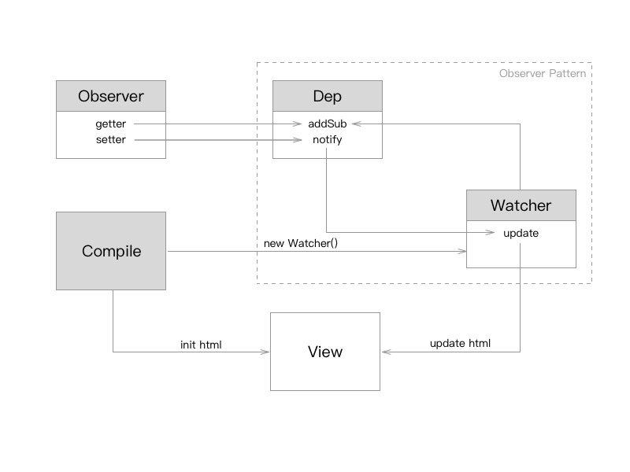

# MVVM 的实现

## 什么是 MVVM

## 提前了解一些知识
### Object.definePropery
在 JavaScript 中 Object.definePropery(obj, prop, descriptor) 这个方法可以定义活着修改原有属性的特性（当然它也可以监听对象中的某个属性值的变化），很多前端 MVVM 框架都会用到这个方法来实现数据的双向绑定。

* `obj` 是必需要传递的目标对象；
* `prop` 需要定义或者修改的属性名称；
* `descriptor` 目标属性所拥有的特性；
    * `value`： 设置属性的值；
    * `writable`： 值是否可写（true | false）；
    * `enumerable`： 属性是否可被枚举（true | false）；
    * `configurable`： 属性是否可以被删除或是否可以再次修改特性（true | false）；
    * `getter`：获得属性值的方法；
    * `setter`：设置属性值的方法；

### 观察者模式
观察者模式属于设计模式中的行为型模式，又称作：发布/订阅模式，它可以让多个观察者对象同时监听某一个主题对象，当这个主题对象发生变化时，会通知所有观察者对象，使它们能够自动更新自己。

*注：设计模式中的三大类————创建型模式、结构型模式、行为型模式*

#### 解决问题：

* 订阅者和观察者之间的解耦：订阅者所知道的只是一个具体观察者列表，每个具体观察者都符合一个抽象观察者的接口，订阅者并不认识任何一个具体观察者，它只知道它们都有一个共同的接口；
* 支持广播通讯：订阅者会向所有注册过的观察者发出通知；

#### 应用场景：

* 

#### 简单实现

```
function Dep () {
    this.subs = [];
}

Dep.prototype = {
    addSub: function(sub) {
        this.subs.push(sub);
    },
    notify: function() {
        this.subs.forEach(function(sub) {
            sub.update();
        })
    }
}

function Watcher(name) {
    this.name = name;
}

Watcher.prototype = {
    update: function() {
        console.log('I am ' + this.name);
    }
}

var dep = new Dep();
var watcher1 = new Watcher('jay');
var watcher2 = new Watcher('min');
dep.addSub(watcher1);
dep.addSub(watcher2);
dep.notify();
```

### DocumentFragment
DocumentFragment 表示文档片段，它不属于 DOM 树，但是它可以存储 DOM，并且可以将所存储的 DOM 加入到指定的 DOM 节点中去。那么有人要问了，那要它何用，直接把元素加入到 DOM 中不就可以了吗？用它的原因在于，使用它操作 DOM 要比直接操作 DOM 性能要高很多(需要测试？)。

```
var st = new Date().getTime();

for (var i = 0; i < 1000; i++) {
    var div = document.createElement('div');
    div.innerText = 'div: ' + i;
    document.body.append(div);
}

console.log(new Date().getTime() - st);
```

```
var st = new Date().getTime();

var fragmet = document.createDocumentFragment();
for (var i = 0; i < 1000; i++) {
    var div = document.createElement('div');
    div.innerText = 'div: ' + i;
    fragmet.append(div);
}
document.body.append(fragmet);

console.log(new Date().getTime() - st);
```

## MVVM 的实现
### 原理


### Observer

```
function observe(obj, vm) {
    Object.keys(obj).forEach(function(key) {
        defineReactive(vm, key, obj[key]);
    });
}

function defineReactive(obj, key, val) {
    var dep = new Dep();

    Object.defineProperty(obj, key, {
        get: function() {
            if(Dep.target) {
                dep.addSub(Dep.target);
            }

            return val;
        },
        set: function(newVal) {
            if(newVal === val) {
                return;
            }
            val = newVal;

            dep.notify();
        }
    });
}
```

### Dep

```
function Dep () {
    this.subs = [];
}

Dep.prototype = {
    addSub: function(sub) {
        this.subs.push(sub);
    },
    notify: function() {
        this.subs.forEach(function(sub) {
            sub.update();
        })
    }
}
```

### Watcher

```
function Watcher(vm, node, name, nodeType) {
    Dep.target = this;
    this.name = name;
    this.node = node;
    this.vm = vm;
    this.nodeType = nodeType;
    this.update();
    Dep.target = null;
}

Watcher.prototype = {
    update: function () {
        this.get();
        if (this.nodeType == 'text') {
            this.node.nodeValue = this.value;
        }
        if (this.nodeType == 'input') {
            this.node.value = this.value;
        }
    },
    get: function () {
        this.value = this.vm[this.name];
    }
}
```

### Complie

```
function nodeToFragment(node, vm) {
    var flag = document.createDocumentFragment();
    var child;

    while(child = node.firstChild) {
        compile(child, vm);
        console.log(child);
        
        flag.appendChild(child);
    }

    return flag;
}

function compile(node, vm) {
    var reg = /\{\{(.*)\}\}/;

    if(node.nodeType === 1) {
        var attr = node.attributes;

        for(var i = 0; i < attr.length; i++) {
            if(attr[i].nodeName == 'v-model') {
                var name = attr[i].nodeValue;
                node.addEventListener('input', function(e) {
                    vm[name] = e.target.value;
                });
                node.value = vm[name];
                node.removeAttribute('v-model');
            }
        }

        new Watcher(vm, node, name, 'input');
    }
    else if(node.nodeType === 3) {
        if(reg.test(node.nodeValue)) {
            var name = RegExp.$1;
            name = name.trim();

            new Watcher(vm, node, name, 'text');
        }
    }
}
```

### MVVM 构造函数

```
function MVVM(options) {
    this.data = options.data;
    var data = this.data;

    observe(data, this);

    var id = options.el;
    var dom = nodeToFragment(document.getElementById(id), this);

    document.getElementById(id).appendChild(dom);
}

var mv = new MVVM({
    el: 'app',
    data: {
        msg: 'hello world'
    }
});
```