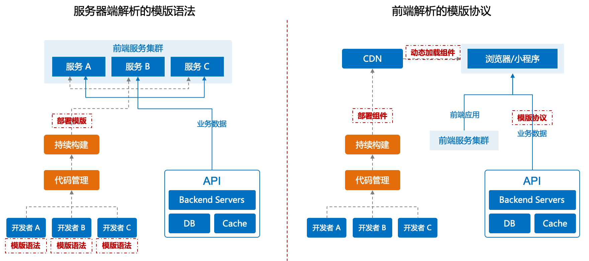
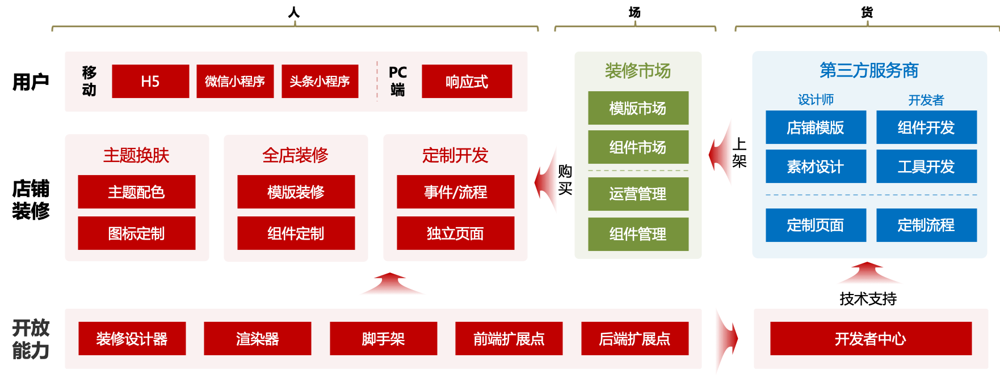
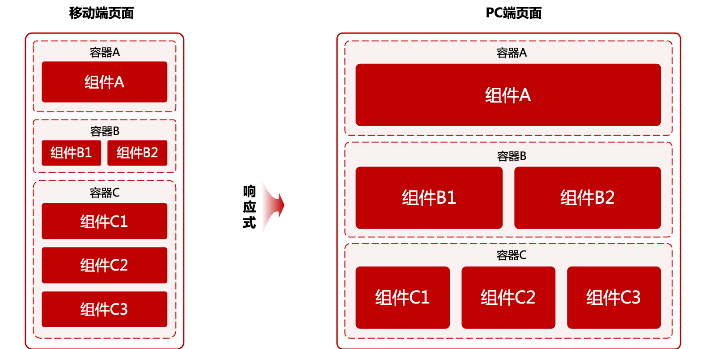
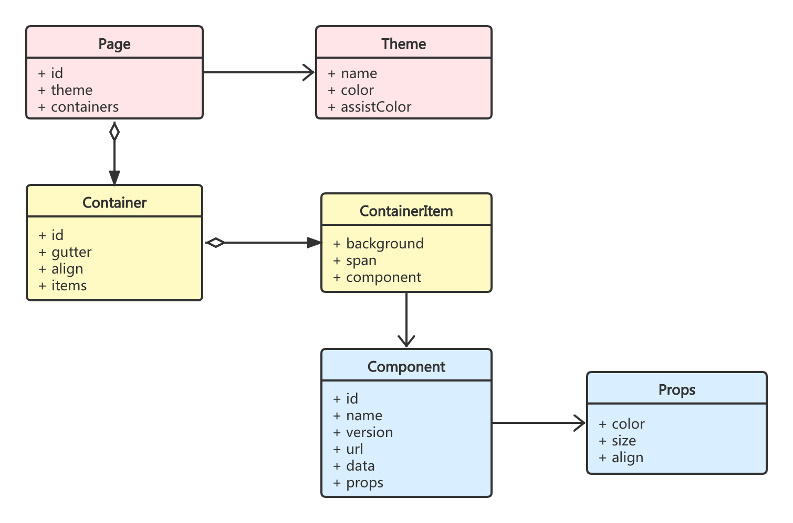
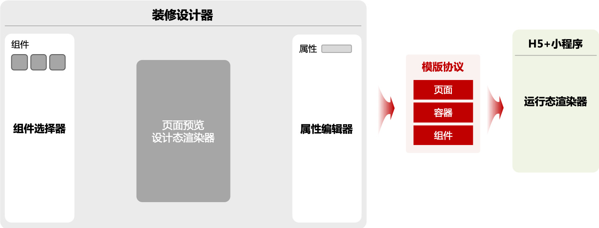
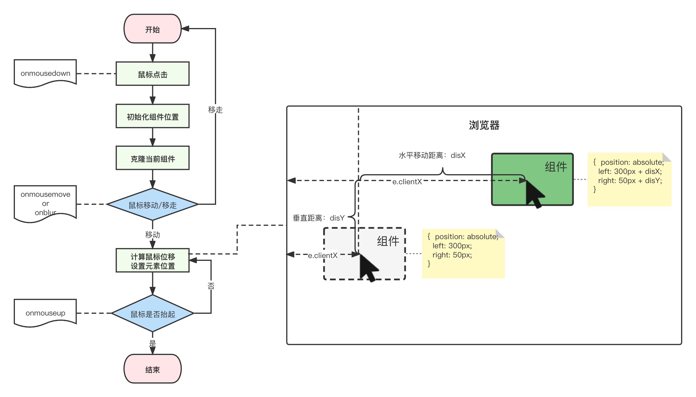
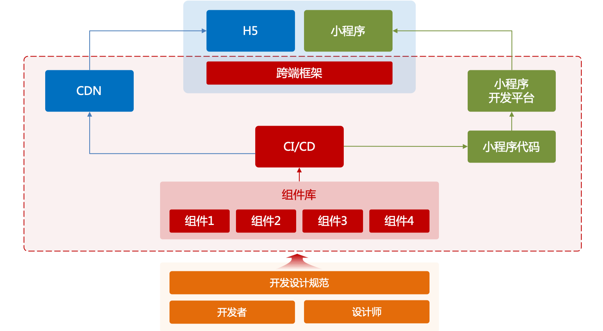
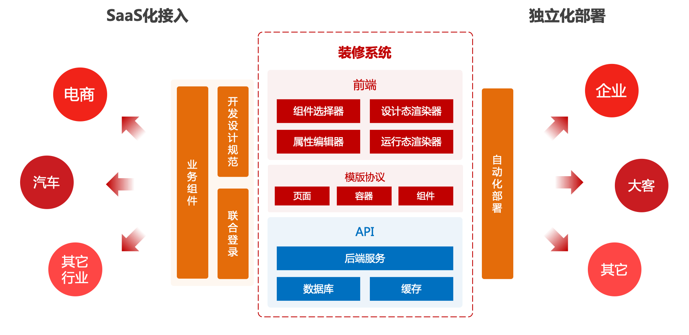

# 电商SaaS店铺装修系统实战从0到1

各大电商平台都有店铺装修能力，好的装修可以给用户营造出良好的购物体验，帮助商家提升品牌形象、提高交易转化率、增加用户留存。通过对装修能力的开放，引入第三方开发者和装修市场，第三方开发者可以提供各种各样的模版、组件在装修市场中售卖，最终给SaaS企业、商家和第三方开发者都带来收益。

装修系统很多，技术方案也五花八门，那么如何搭建一套装修系统，我将从如下几个方面和大家探讨一下装修系统从0到1的过程，当然这里只是一些比较粗略的设计，帮助大家了解店铺装修的相关开发经验，如果要做到产品化、商业化需要下一定的功夫。

这篇文章您将了解：
* 一、整体设计
* 二、模版协议设计
  * 组件
  * 容器&布局
  * 页面
* 三、装修设计器三大件
  * 组件选择器
  * 渲染器
  * 属性编辑器
* 四、跨端与动态组件
* 五、不断演进
  * 用户体验
  * 生态建设
  * 产品化
* 六、问题与改进
* 七、总结

## 一、整体设计

装修系统操作的**易用性**、运营的**效率**和**定制化**能力是整个系统设计的重要原则。电商SaaS系统是给普通商家用户使用的，他们不像电商平台专业人员能够操作复杂的系统，简化操作才能降低用户学习成本；通过一次装修需要能够生成多端（H5、小程序等平台）商城页面，可以帮助商家提高运营工作效率；通过开放接口和前端扩展点，快速实现前端页面定制，有利于生态环境的建设。

店铺装修技术方案有两种方式：一种是通过**服务器端解析的模版语法**来做到个性化装修，模版语法通常是类似于`Ruby`、`PHP`这种服务端脚本语言来实现的，它的优点是定制化程度非常高，同时带来的技术上成本也会变高，需要真正做到每个店铺独立部署；另外一种方式是，通过**前端解析的模版协议**来做个性化装修，通常是用`JavaScript`前端脚本语言来实现，它的优势在于技术成本不高，统一部署统一管理，但定制化程度有限，需要在一定的规则内定制。两种方式没有好坏之分，适合自己的是最好的。另外技术层面上的缺点，并不一定是劣势，也许成为会成为你的“护城河”。

简单介绍一下两种方案，**服务器端解析的模版语法**是开发人员通过一套模版语法将页面设计好后，通过自动化部署系统将代码部署到不同前端服务器中，个性化的页面是通过服务器模版语法组装出来的；而**前端解析的模版协议**是开发人员开发不同的组件，通过自动化部署系统将组件发布到CDN（或者其它的组件管理系统），个性化页面是前端通过不同的模版协议组装出来的。



我们这里的方案会更偏前端，采用一套模版协议来实现个性化装修。好在现在的前端开发都使用的是MVVM框架（`Vue`、`React`、`Angular`），数据可以来驱动页面的渲染，也就是说我们通过设计出一套数据结构，让程序来解析和编辑这套数据结构，那么在客户端只需要根据这套数据结构渲染就行，而管理端是通过界面交互来创建出这个数据结构。我们用更加专业的描述：通过**装修设计器**生成页面**模版协议**，让**渲染器**来解析这个协议，最终达到店铺装修所见即所得的效果。

在开放生态方面，我们需要提供一套**开发工具**，能够让第三方开发者很容易的开发自己的组件和模版，并上架**装修市场**，商家也能够方便的从装修市场上购买到符合自己商城的组件和模版。



## 二、模版协议设计
模版协议的数据结构是整个店铺装修技术方案的核心，好的数据结构对系统的性能、稳定性和可扩展性上有一定的帮助，当然也是需要一定的抽象能力。

为了能够将整个页面动态的渲染出来，服务端给出的**模版协议**要让前端很容易的解析这些数据，它需要有解释页面的能力。我们通过页面内包含的模块来做设计，把页面渲染所需的模块分成：
* 页面：负责页面的整体信息；
* 容器：负责页面楼层的布局；
* 组件：负责各个楼层的功能；



### 2.1 页面
整个页面的内容要包含上面的容器、组件和一些页面的基本信息（主题色、辅助色、背景等等），这部分的设计相对简单：

| 属性名称 | 数据类型 | 属性含义 | 备注 |
| - | - | - | - |
| **id** | string | 页面ID | 名称：'page_01' |
| **theme** | object | 页面主题 |  |
| theme.**name** | string | 主题名称 | 名称：'defalut' |
| theme.**color** | string | 主题主色 | 主色：'#000000' |
| theme.**assistColor** | string | 主题辅色 | 辅色：'#cccccc' |
| **containers[]** | array | 容器 | 一个页面由多个容器组成 |

### 2.2 容器&布局
组件是解决最小单元功能问题，如何把这么多功能组件有效的组合在一起，需要有一套高效的布局方案，为了兼容移动端和PC端，可以采用比较流行的栅格布局。栅格系统在很多组件库中都支持，例如：`Bootstrap`、`AntD`、`ElementUI`、`Pure`等，甚至原生的 CSS3 也支持栅格布局（`Grid`），它们的设计也如出一辙，通过网格的行数和列数来控制容器内部的内容，从而产生不同的布局效果，并且能够适应不同的屏幕大小，在不同的屏幕上可以展示适应屏幕的布局。相关的基础知识可以去相关技术官网上学习。

页面的每一个楼层显示一个或者多个不同的组件，这些组件通过24栅格系统（可以参考`AntD`、`ElementUI`栅格系统的相关原理）来布局，多个楼层最终搭建起整个页面的效果。容器的设计如下：

| 属性名称 | 数据类型 | 属性含义 | 备注 |
| - | - | - | - |
| **id** | string | 容器ID | 名称：'container_01' |
| **gutter** | number \| array | 栅格间隙 | 间隙：[10, 12] |
| **align** | string | 对齐方式 |  |
| **items[]** | array | 栅格项 |  |
| items[].**component** | object | 组件 | 一个容器项放入一个组件 |
| items[].**background** | string | 栅格背景 | 背景：'#cccccc' |
| items[].**span** | number | 栅格占位格数 |  |
| items[].**sm** | number | 屏幕 < 768px 时，栅格站位格数 | 响应式栅格 |
| items[].**md** | number | 屏幕 ≥ 768px 时，栅格站位格数 | 响应式栅格 |
| items[].**lg** | number | 屏幕 ≥ 992px 时，栅格站位格数 | 响应式栅格 |

### 2.3 组件
组件包含两方面的核心数据：组件基本信息和组件的属性。组件的基本信息是来描述组件的名称、版本、加载地址等信息，让前端知道到底要加载哪个组件，组件长什么样等；组件的属性，其实就是显示数据，例如：大小、颜色、对齐方式等。

另外组件还有一个比较重要的信息，就是业务数据，例如：要显示商品的名称、图片、价格等等，它们还有可能是一组数据集，甚至还有可能是来自一个接口的动态数据，所以这块的设计比较复杂，我们暂时用简单数据来设计，初期比较简洁快速的落地。

在设计过程中尽量保持简单、层次浅的设计原则，我们可以对组件做出如下定义：

| 属性名称 | 数据类型 | 属性含义 | 备注 |
| - | - | - | - |
| **id** | string | 组件ID | 名称：'image_01' |
| **name** | string | 组件名称 | 名称：'title' |
| **version** | string | 组件版本 | 版本：'1.1.0' |
| **url** | string | 加载组件的地址 | |
| **props** | object | 组件属性集合 | |
| props.**color** | string | 组件颜色 | 颜色：'#000000' |
| props.**size** | string | 组件尺寸 | 尺寸：'default'，'small'，'big' |
| props.**align** | string | 对齐方式 | 对齐：'left'，'center'，'right' |
| **data** | object \| array | 业务数据 | |

### 总结
整个模版协议其实是按照页面的组成来设计的，包含：页面信息、容器及其布局、组件信息几部分组成，前端只需要获取到一个`JSON`数据，就可以按照这个数据结构来渲染页面了。当然这只是核心的数据结构，还有其它的例如：用户信息、页面列表、组件列表等可以按照自己的业务需求自行设计。每个模块的关系如下图：



以下是一个模版协议的例子，内部包含页面主题、一列的布局方式、容器中有两个组件一个头部组件和一个图片组件：

``` javascript
{
  id: 'page_01',
  theme: {
    name: 'default',
    color: '#000000',
    assistColor: '#cccccc'
  },
  containers: [{
    id: 'container_01',
    gutter: 10,
    items: [{
      id: 'container_item_01',
      span: 24,
      background: '',
      component: {
        id: 's_header_01',
        name: 's-header',
        props: {
          color: '#999999',
          align: 'center',
          title: 'Hello World!'
        }
      }
    }, {
      id: 'container_item_02',
      span: 24,
      background: '',
      component: {
        id: 's_header_01',
        name: 's-image',
        props: {
          color: '#999999',
          src: ''
        }
      }
    }]
  }]
}
```

## 三、装修设计器三大件
店铺装修的核心三大组件：**组件选择器**、**渲染器**和**属性编辑器**，它们之间的交互组成了装修设计器，装修设计器最终目的是为了生成模版协议的数据结构。



### 3.1 组件选择器
组件选择器相对简单，服务端根据当前用户返回可以使用的组件列表就行，如果稍微复杂点可以增加组的概念，把各个组件分类显示，其实它的实现并不难。另外在交互上需要实现的是，通过拖拉拽将组件移动到渲染器中，这部分市面上也有专门的插件例如：`Vue.Draggable`、`Dragula`等，利用成熟的插件的好处就是各种异常、兼容性、性能都是经得起考验的。当然我们也可以自己来实现，它的原理是：通过监听鼠标的位移，来设置DOM的位置。

先了解鼠标事件顺序：`onmouseover`->`onmousedown`->`onfocus`->`onmousemove`->`onmouseup`->`onclick`->`onmouseout`->`onblur`。我们可以利用其中3个事件：**onmousedown**触发时高亮被选择的元素并初始化位置，**onmousemove**触发时开始计算鼠标的位置移动并移动被选择的元素，**onmouseup**触发时停止拖拽。

另外我们要考虑鼠标的位置与DOM位置关系，鼠标当前的位置的参照物比较多，例如：`clientX`和`clientY`是相对于浏览器窗口，`offsetX`和`offsetY`是相对于目标对象，`pageX`和`pageY`是相对于文档窗口，`screenX`和`screenY`是相对于计算机屏幕。同样DOM的位置参照物也比较多：`offsetLeft`和`offsetTop`相对于父元素位置，`clientLeft`和`clientTop`是DOM内边距到边框外边缘之间距离。另外还有一个问题，这些位置的值是只读的，要给DOM设置位置只能通过CSS，然而CSS的位置又与它父元素的位置有关系，所以整个过程是一个非常复杂的过程。



当然这些还是不够的，在移动过程中我们需要考虑性能问题，不断的计算位置和设置位置会影响页面的渲染性能，我们在频繁的计算过程中需要增加一些防抖&节流，减少移动过程中的计算，同时需要增加一些动画效果让整个过程看起来更加流畅，还有很多异常情况没有考虑，未来有机会我们可以用一个专题来讲拖拉拽。

### 3.2 渲染器

渲染器分两类：**运行态渲染器**和**设计态渲染器**。运行态渲染器相对容易，仅仅是将服务端返回的数据渲染成页面即可，但设计态渲染器就相对复杂，不仅需要有渲染功能，还需要有编辑楼层、布局、组件的功能，而且还要增加些交互效果。

先从简单的开始，渲染器的渲染功能，其实就是将上面模版协议通过层层递归的方式，将容器和组件一个一个组装出来。实现起来并不难，通过上面的设计两层循环就能完成：

```vue
<view class="s-renderer">
  <view
      class="container"
      v-for="(container, idx) in protocol.containers"
      :key="idx"
      :id="container.id">
    <view
      class="container-item"
      :span="24"
      :id="item.id"
      v-for="(item, itemIndex) in container.items"
      :key="itemIndex">
      <component
        :is="item.component.name"
        v-bind="item.component.props">
      </component>
    </view>
  </view>
</view>
```

渲染器的编辑功能我们可以借助于操作**HTML DOM**的思想，通过寻找到容器模块然后向这个容器中插入组件即可。其实这种编辑的过程是对**模版协议**的数据结构的操作，那么核心的三个功能是：

* queryModule(id: number)：查询到容器或者组件模块，它的目的是精准的获取到需要编辑的模块；
* appendModule(container: object, module: object)：向容器模块中添加子模块（子容器或者组件）；
* removeModule(id: string)：将某个模块从模版中删除掉；

可以看出来，整个过程就是对模版协议这个树形的数据结构做查询、新增、删除的操作，只不过这里的设计做了一些简化，让模版协议的层级是有限，这样我们对“树”的操作更加快捷一些。

### 3.3 属性编辑器

属性编辑器其实就是设置组件的属性（大小、颜色、对齐方式）和业务数据，它需要做到与渲染器数据同步，达到所见即所得效果，通常属性编辑器以表单的形式出现，它和很多设计工具（例如：Photoshop）右边的工具栏比较类似，属性编辑器有两种实现方式：

* 完全由开发人员自定义开发：
  * 优势：灵活性高，可以应对复杂业务场景。
  * 缺点：开发复杂度高，不同组件风格不一致。
* 通过组件绑定数据自动生成：
  * 优势：一次性处理开发简单，风格统一。
  * 缺点：难以处理复杂场景。

两种实现方案各有利弊，大家可以根据自己的场景灵活选择，我们先选择简单的方式来实现，通过组件绑定的数据来自动生成，这样组件的属性以及业务数据就需要进一步扩展，属性和业务数据上需要表明这个数据的设置需要使用什么类型的表单组件（`input`、`radio`、`checkbox`），这样一来属性编辑器其实是对组件的属性和业务数据的解析过程。

```javascript
// 对组件的属性进行扩展
component: {
  id: 's_header_01',
  name: 's-header',
  props: {
    color: {
      name: '颜色',
      type: 'input',
      value: '#999999'
    },
    align: {
      name: '对齐方式',
      type: 'select',
      options: []
      value: 'center'
    },
    title: {
      name: '标题',
      type: 'input',
      value: '这是输入框'
    }
  }
}
```

```vue
// 将组件的属性，解析成编辑表单
<form-model class="props-editor">
  <form-model-item
    v-for="(attr, key) in props"
    :key="key"
    :label="attr.name"
    :prop="key">
    <component
      :is="attr.type"
      v-bind="attr">
    </component>
  </form-model-item>
</form-model>
```

## 四、跨端与动态组件

商家之所以使用电商SaaS系统，是为了通过自己的私域流量来变现，而私域流量平台众多：微信、抖音、快手、小红书等等，那么多端适配是我们值得做的一件事情，多端适配需要底层框架的支持，幸运的是市面上已经有各种框架帮我们造好了轮子：`Taro`、`Remax`、`Uni-app`等，它们都可以做到跨主流端，这些框架的原理基本一致：自己有一套语法，通过语法解析成不同平台的代码后再编译成最终目标平台的程序。所以这部分我们可以根据自己的团队情况来选择不同的框架开发即可。

随着系统功能越来越丰富，程序的体积也会越来越大，对H5来说问题不大，但是小程序对整体包的大小是有一定限制的，即使是小程序现在有分包能力，但是随着未来SaaS系统生态的加入各种第三方开发者的组件成千上万，小程序容量不可能无限增加，动态组件是未来需要解决的问题。解决这一问题，我们用两种方式：**运行时动态组件**和**编译时动态组件**。

**运行时动态组件**，在Web的领域相对成熟，类似于AMD模块规范就能够解决这个问题，并且现在各种构建工具都具备这个能力，针对H5这种非常开放的环境我们可以采用运行时动态组件；**编译时动态组件**，需要完成一套小程序按需自动化发布系统，可以按照用户定制化的功能自动的组合出一套代码，并帮助用户构建打包发布，对微信小程序这种相对封闭的环境我们可以采用编译时动态组件，这种方式对系统要求相对比较高。



## 五、不断演进

上面的**模版设计**与**装修设计器**三大件如果都实现了，基本的店铺装修能力就已经具备了。但是对于一个商业化SaaS项目这些肯定是不够的，基于这些核心能力需要让整个系统产生更多的商业价值，我们需要对系统的**用户体验**和**生态建设**上进一步改进。

### 5.1 用户体验

装修的用户体验有很多方面，对于SaaS系统来说好的用户体验分如下几点：易用性、有用性、可靠性。

**易用性**通常表现在使用的直观感受上，如何让用户在使用的过程中感受到学习成本低、操作效率高、交互体验好。这一层面需要交互设计师和UI设计师的发挥，并且它是一件非常专业的事情，好的设计不需要太多的修饰，特别是SaaS系统我们要做减法，不能像一个给专业人士用软件需要经过长时间的培训才能用起来。

**有用性**通常表现在系统功能是否给用户带来价值。首先需要给用户提供可选择的丰富功能，而且这些功能是确实能够帮助用户解决问题的，产品设计需要考虑到真实的使用场景。很多时候我们会思考很多产品功能，但这些功能对用户是不是真正有价值的，甚至用户是不是真正在使用的，我们需要做很多事情，通过数据统计、用户反馈、用户调研等等方式才能收集到用户的真实需求。

**可靠性**通常表现在用户认为是系统是值得信赖。这一层面的体验要求比较高，不仅在技术上让系统可用性高，而且需要在产品层面上让系统是有“情感”的。系统本身的稳定性、可用性是可以让用户感受到它可靠，但这是不够的，如果能够让用户在使用的过程中感受到并不是在面对一个机器，而是面对一个“为用户服务的人”，这种可靠性更加的有感情，也更能够抓住用户的心智，提升SaaS系统的用户黏性和复购率。

### 5.2 生态建设

生态建设是商业化SaaS系统需要做的，这也是SaaS系统的重要收入来源之一，生态建设是建立在开放能力的基础之上的。关于店铺装修的生态建设，有两件重要的事情要做：

* 如何让第三方开发者/设计师能快速对接装修系统？
* 如何让商家（客户）购买适合的店铺装修“素材”？

那么**开发者中心**和**装修市场**能够解决这两个问题：开发者中心提供一套对外的接口，让开发者/设计师能够通过一套**规范**开发出店铺装修需要的模版和组件等"素材"，并且有一套机制来审核并上传这些“素材”；那么装修市场则是一个能够让商家搜索并购买到适合自己店铺的装修“素材”。这两个系统就像电商平台的“供应链系统”和“客户端系统”，一个提供货源、一个提供买卖市场。

这一整套生态系统的建设是一件非常庞大的事情，需要一步一步的丰富和完善。开发者中心：需要提供一些脚手架、接口、SDK、扩展点甚至系统运维工具帮助开发者来开发装修“素材”，另外还需要装修“素材”的管理、审核、上架等机制的建设；装修市场：需要提供一整套“素材”的购买流程，从搜索、商详、评价到支付，另外还有售后流程，会涉及到退货、退款等等。

### 5.3 产品化

当系统建设到一定程度，底层能力会越来越抽象，并且自动化构建部署能力也越来越完善，那么装修系统的通用能力是否能打造出一个产品化的东西出来呢？页面装修并不是电商平台独有的，旅行、汽车、珠宝首饰等行业也有这方面的诉求，其实不同行业的系统对页面装修的差异在于**业务组件**和系统**登录态**的打通。我们可以通过一套组件开发规范，再加上一套联合登录系统，让第三方对接进来，只需要第三方开发出符合自己业务组件就行。另外有一些要求高的客户需要独立化部署，让系统底层进一步与业务解耦，并且通过一套自动化部署系统将整个装修系统独立部署到第三方。



## 六、问题与改进

* 组件的版本管理：
  组件的功能会不断的更新，如果有了大的变化而商家还没有对新特性做配置就强制更新，会导致最新版本的组件不兼容问题。如何让众多店铺的组件能够做到平滑的过渡，是需要我们考虑的问题。
* 组件之间的交互：
  要做到全店铺装修，是一件非常困难的事情，很多场景组件交互非常复杂，组件和组件之间有各种联动操作，例如在电商场景的新增购物车，可能存在多个组件之间联动甚至有复杂的动画效果，如何处理这种复杂的交互，也是一件有挑战的事情。
* 组件安全与性能：
  随着系统的不断开放，会有更多第三方开发者入驻开发，成百上千的组件发布到装修市场，并且能够被各个商家购买使用，保证组件和整个系统的安全与性能也是一件值得挑战的事情。

## 七、总结

上面介绍了整个电商SaaS店铺装修系统，从整体设计、模版协议设计和装修设计器三大件，这些是从0到1的过程。模版协议是整个装修的核心，它是来描述整个页面内容的；而装修设计器是对模版协议的编辑，它是对整个页面进行设计的，其中渲染器是前端的重中之重，它提供页面渲染、页面布局、组件的编辑等功能。如果要继续打磨产品那么需要不断的提升用户体验和开放生态的建设，那么这部分是从1到100的过程......
