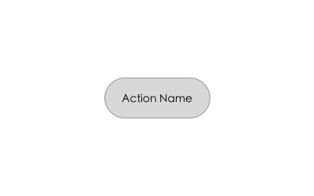
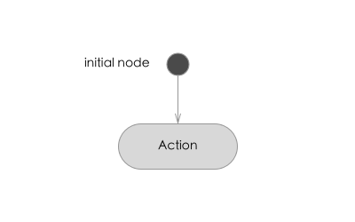
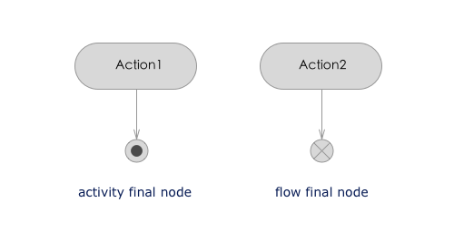
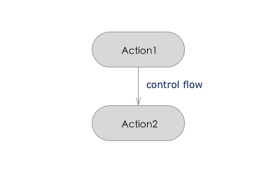
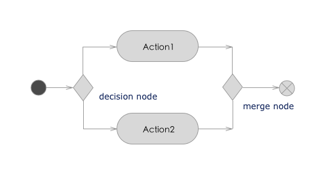
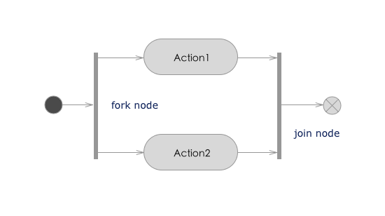
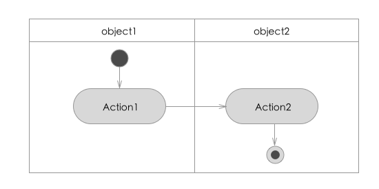
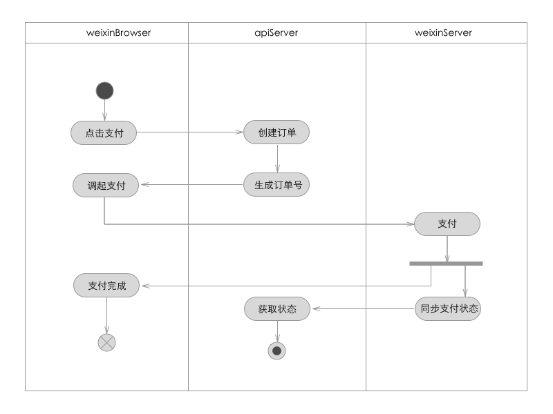

# UML 之活动图
活动图在 UML 中是非常常见的建模工具，它很像流程图，它表达出角色、工作流、组织和对象是如何工作的。它对理解业务处理的过程非常有用。

活动图中包含的元素由：活动、开始和中指节点、动作流、对象、分支合并、分叉汇合以及泳道等元素组成。

## 活动图中的元素

### 活动
活动是活动图主要节点，代表某一个活动或者流程的一部分。它用两边为弧的条形框表示。

### 开始节点
活动图中开始节点有一个黑色的圆点表示，它表示整个活动的开始。

### 终止节点
终止节点分为活动终止节点和流程终止节点：

* 活动终止节点代表整个活动的结束，它用空心圆点表示；
* 流程终止节点表示子流程的结束，它用叉圆点表示。

### 动作流
每个活动之间的转换称为动作流，它由带有箭头的直线表示，箭头的方向指向转入的方向。

### 对象
对象在活动图中

### 分支与合并
分支类似于流程图中的判断，合并代表多个分支的动作流指向同一个节点。它们都用菱形表示。

### 分叉与汇合
分叉代表多个并发的动作流，汇合则用于同步这些并发分支。

### 泳道
泳道将活动图划分为多个组，它明确表明哪些活动是由哪些对象进行的。

## 活动图 Demo
同样我们用微信支付来作为例子：

