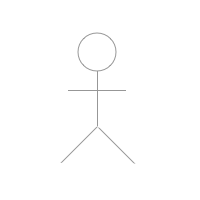
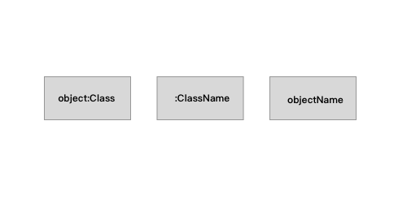
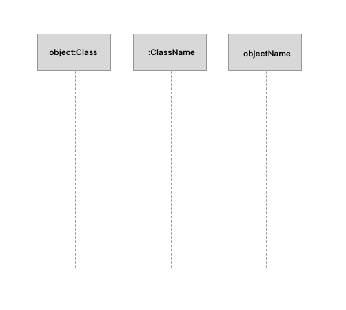
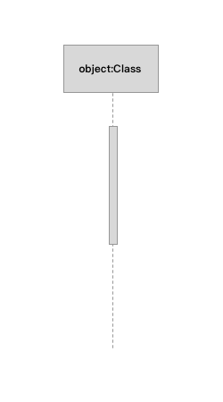
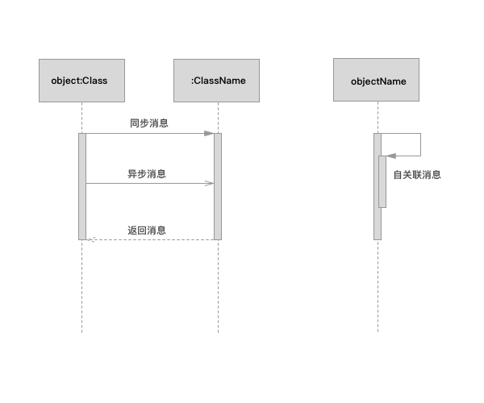
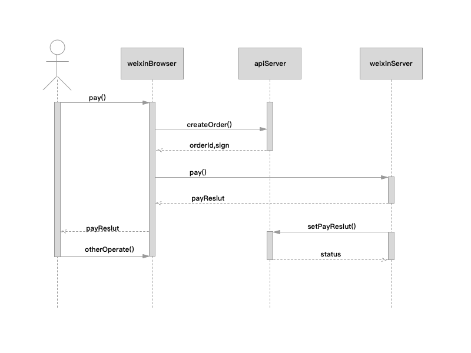

# UML 之时序图
时序图是用来表示对象之间的交互关系，对象按照时间顺序排列，图中会表示参与交互的对象以及对象之间消息传递的顺序。时序图在项目中可以清晰的表达出各个对象或者各个系统之间的关系，在开发设计中起到很重要的作用。

时序图中包含元素有：对象、生命线、控制焦点、消息等；

## 时序图中的元素

### 角色
系统角色，可以是人或者其它系统。角色可以用下面的图表示：

### 对象
整个交互过程中的实体，可以是一个具体的类也可以是另外一个系统。对象可以用下面的图表示：

### 生命线
生命线在顺序图中表示为从对象图标向下延伸的一条虚线，表示对象存在的时间，如下图：

### 控制焦点
控制焦点是顺序图中表示时间段的符号，在这个时间段内对象将执行相应的操作。用小矩形表示，如下图：

### 消息
消息又分如下几种：

* 同步消息：发送者将消息发送给接收者后，停止活动直到接收者返回控制；
* 异步消息：发送者将消息发送给接收者后，活动继续执行，不用等待接收者返回控制；
* 返回消息：消息从接收者返回给发送者；
* 自关联消息：表示对象调用自己内部方法的消息传递。

## 时序图 Demo

在做微信支付时经常会遇到跨系统的复杂交互，我们可以用时序图很好的表达出系统与系统之间的关系：

