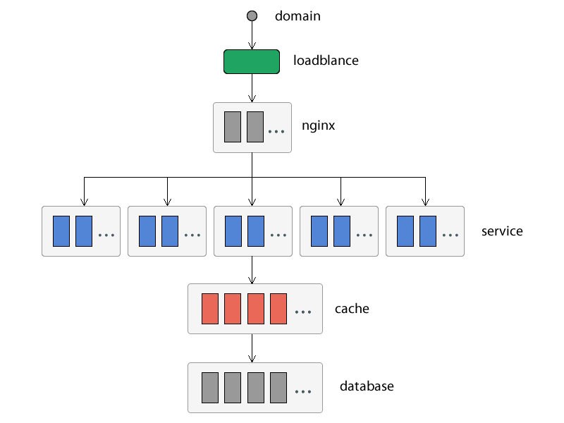
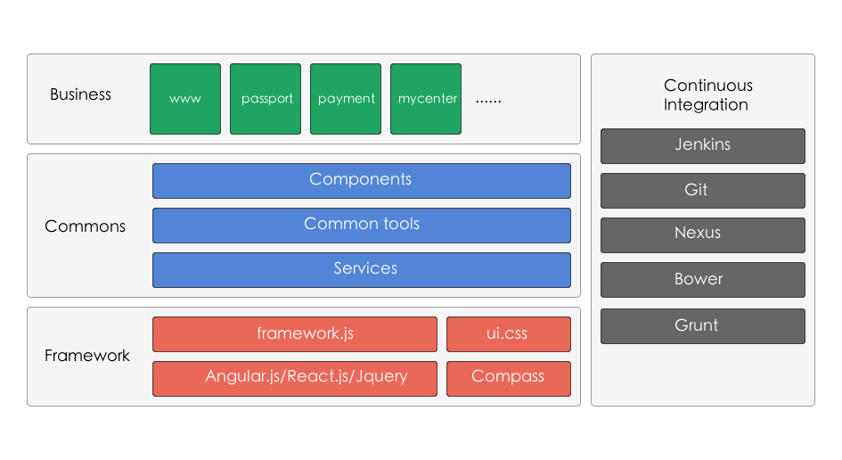

# 为什么需要架构
或许大家听到**架构**两个字，就觉得是一个非常高不可攀的事情，当然大系统有大系统的架构，小软件有小软件的架构，清晰良好的架构对软件系统的扩展性和性能都有好的帮助。

架构一个系统，就好比整理自己的书架一样，刚开始书少的时候甚至不需要书架，如果书越来越多，就需要对书进行分类，把类型相同的放到一起便于查找，当大到图书馆时，还需要对书进行编号，记录书的借还情况，还要定期整理和回收书。如何整理摆放、如何回收书籍、如何知道书现在的状态、如何快速的查找书，这都是整个架构需要考虑的问题。

当然好的架构是需要良好的抽象能力和项目经验，对于软件系统需要有一定的了解程度，还要对业务流程有一定了解，并且还设计的安全、体验甚至是团队协作的问题等等。

## 什么样的架构才是好的
好的架构需要达到如下目的：

* 可靠性；
* 安全性；
* 可扩展性；
* 可定制化；
* 可伸缩；
* 可维护性；
* 客户体验；
* 市场时机。

## 从哪儿入手？
架构是一个抽象的过程，不仅要从逻辑上还要从物理上去设计各个模块以及模块和模块之间的关系。我们可以先从服务器的职责开始，然后到各个系统，接下来到软件系统结构、代码结构，从全局到局部的去架构自己的系统。
### 部署结构
部署结构是对每个（或者每组）服务器的职责，以及它们之间的关系的规划，每一层都有它的功能，并且需要设计的高可用、容易扩展和良好的安全性。

通常互联网的部署结构如下图：


* 负载均衡器：可以将网络请求分摊到多台服务器下，它提供了一种廉价的有透明的方法扩展服务器的带宽，具有很高的吞吐量，提供很好的灵活性和可靠性；
* Nginx 分流：一个高性能的反向代理服务器，可以根据不同的路由规则将流浪分到不同的服务器，对整个系统的伸缩性和可扩展性有帮助；
* 应用服务器：业务和服务核心，所有的业务以及服务都在应用服务器中，当然可定制、用户体验都体现在这儿；
* Cache 服务器：缓存服务器，提高性能就靠它；
* DataBase 服务器：所有的数据都由它来提供。

**这些服务都是以集群的形式存在，最大程度的保证了系统的可用性**

### 系统结构
系统结构在逻辑上反应出整个系统内部模块之间的关系，以及系统的输入和输出。通常系统结构会分很多层，每一层都由一系列的模块组成，并且每一层的模块会解决一类或者多类别的问题。层次越往下，抽象程度越高。通常最底层的模块都会演化成通用框架，中间层都会成为业务级框架，最外层是改动最多的业务层。以下是一个非常通用的网站系统结构：


* 业务层：纵向为业务层，每个模块将部署在不同的服务器中；
* 公共层：公共层将解决业务的公共逻辑，有一些公共组件、公共工具、公共服务等等；
* 框架层：框架层将解决存储、计算、通讯、UI 组件等问题，它是抽象得最为彻底的一层，离开当前业务也能使用；
* 持续集成：解决一些重复性的编译、打包、部署等工作。

以上是一个非常通用的互联网网站系统架构，当然系统架构也是随着业务不断成长，不断完善的，它不是一个一层不变的东西。

### 代码结构
代码结构将进入具体的实施，代码结构源于系统结构，是系统结构的物理表现，Java 的很多 Maven 项目都是很多开发人员积累下来的代码结构，每个接口、类、配置、jsp页面如何摆放，其实它也于持续集成息息相关。以下是 WebApp 常用的代码结构：

```
|-.sass-cache
|-app
|  |-inc
|  |  |-metas.html
|  |  |-scripts.html
|  |  |-styles.html
|  |-lib
|  |-resources
|  |  |-icons
|  |  |-images
|  |-sass
|  |  |-components
|  |  |-app.scss
|  |  |-index.scss
|  |-scripts
|  |  |-components
|  |  |-controllers
|  |  |  |-index.js
|  |  |-app.js
|  |-views
|  |  |-components
|  |  |  |-header.html
|  |-index.html
|  |-version.json
|-bower_compoents
|-config
|-debug
|-deploy
|-dist
|-mode_modules
|-.gitignore
|-bower.json
|-Gruntfile.js
|-package.json
```

## 持续集成


