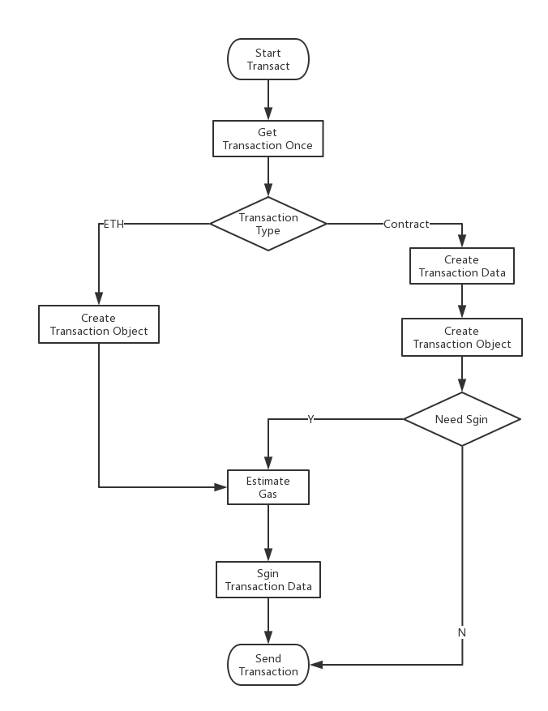
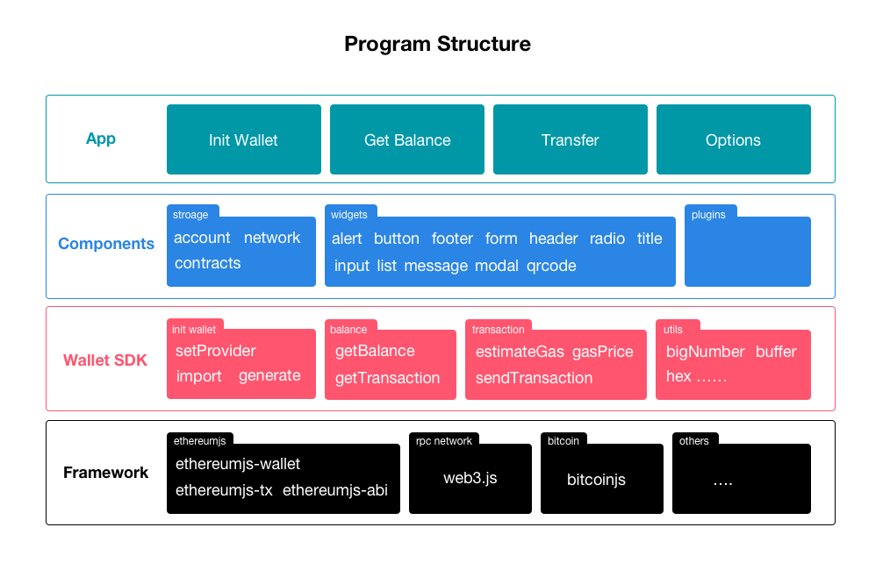

# WEB 数字钱包初探
最近区块链风靡互联网行业，个人也专门了解了相关技术，也买过数字货币，当然也有数字钱包。一直在思考这种去中心化的钱包，到底安不安全，原理是个啥：

* 我们的钱包密码（私钥）或者其它钱包信息，是否会在网络中传输？
* 各大交易平台中，我购买的数字货币到底在哪儿？
* 区块链中到底有没有用户的钱包信息？

带着这些问题，我们要研究一下数字钱包到底是咋回事？先搞清楚一些概念：

* 加密
* 对称加密
* 非对称加密
    * 公钥、私钥
* 签名
    * 验签

## 加密 & 对称加密 & 非对称加密
加密学在区块链技术中属于核心技术之一，钱包的生成也是由加密算法来完成的，当然如果讲述加密技术对我这个不专业的人来说不能讲述的非常明白，不过我们从对它的功能上来大概的了解一下相关概念。

通俗的讲：

* 加密：把东西（信息）用钥匙锁在箱子里面，只有拿到钥匙的人才能使用这个东西（查看信息）；
* 对称加密：关闭箱子的钥匙和打开箱子的要是一样；
* 非对称加密：关闭箱子的钥匙和打开箱子的不一样；

专业的讲：

* 加密：将明文信息改变为难以读取的密文内容，使之不可读。只有拥有解密方法的对象，经由解密过程，才能将密文还原为正常可读的内容；
* 对称加密：加密和解密时使用相同的密钥；
* 非对称加密：需要两个密钥来进行加密和解密，它们分别是公钥和私钥，如果用公钥对数据进行加密，只能用对应的私钥才能解密；如果用私钥对数据进行加密，那么只能用公钥才能解密；

### 为什么要用非对称加密，应用场景在哪儿？
其安全性更好：对称加密的通信双方使用相同的秘钥，如果一方的秘钥遭泄露，那么整个通信就会被破解。而非对称加密使用一对秘钥，一个用来加密，一个用来解密，而且公钥是公开的，秘钥是自己保存的，不需要像对称加密那样在通信之前要先同步秘钥。

但是，非对称加密的缺点是加密和解密花费时间长、速度慢，只适合对少量数据进行加密。

## 签名
为了能让信息的接收方得知发送方的身份，数字签名技术运用而生。

数字签名是一种以电子形式存在于数据信息之中的，或作为其附件或逻辑上有联系的数据，可用于辨别数据签署人的身份，并表名签署人对数据信息中包含的信息的认可技术。

* 签名过程：
    * 生成数据摘要：将要发送的数据进行 Hash
    * 生成签名信息：用**发送者私钥**对数据摘要进行加密
    * 将即将发送的数据+签名信息 发送给接收者
* 验签过程：
    * 解密签名信息：用**发送者公钥**对签名信息进行解密
    * 生成数据摘要：将接收的数据进行 Hash
    * 对比数据：如果解密的签名信息和生成的数据摘要相同则能确认该数字签名是发送者

## 加密算法
加密算法有很多种：RSA、RC2、RC4、IDEA、RSA、DSA、ADS、MD5、PKCS、ECC 等等，想了解算法的同学自己百度一下。

## 钱包需要什么功能？
钱包的核心功能：

* 钱包初始化
    * 创建
    * 导入
* 查询钱包的资产
* 交易
    * 转账
    * 调用合约

## 相关 Js 库

* ethereumjs-util：工具类
    * bn.js：BigNumber 数据类型
    * safe-buffer：Buffer 二进制数据类型
    * create-hash: Hash 算法
    * secp256k1：椭圆曲线算法
    * keccak：SHA-3 算法
    * rlp：RLP 编码
    * ethjs-util
* ethereumjs-wallet：钱包创建
* ethereumjs-tx：交易信息处理，签名、Hash、校验等
* ethereumjs-abi：ABI 处理
* web3：和以太坊之间通讯

## 钱包的创建（私钥、公钥、地址）
创建钱包我们可以采用 `ethereumjs-wallet` 库来完成，它是基于 椭圆曲线的ECDSA 算法来创建密钥对的。看源码：

* 公钥生成：(ethereumjs-wallet)generate() -> (ethereumjs-util)privateToPublic -> secp256k1.publicKeyCreate -> publicKey
* 地址生成：(ethereumjs-wallet)generate() -> (ethereumjs-util)privateToAddress -> (ethereumjs-util)sha3 -> (keccakjs)SHA3 -> address

```
// ethereumjs-wallet 模块
Wallet.generate = function (icapDirect) {
    if (icapDirect) {
        while (true) {
            var privKey = crypto.randomBytes(32)
            if (ethUtil.privateToAddress(privKey)[0] === 0) {
                return new Wallet(privKey)
            }
        }
    } 
    else {
        return new Wallet(crypto.randomBytes(32))
    }
}

var Wallet = function (priv, pub) {
    //...
}

Object.defineProperty(Wallet.prototype, 'pubKey', {
  get: function () {
    if (!this._pubKey) {
        this._pubKey = ethUtil.privateToPublic(this.privKey)
    }
        return this._pubKey
    }
})

// ethereumjs-util 模块
exports.privateToAddress = function (privateKey) {
    return exports.publicToAddress(privateToPublic(privateKey))
}

var privateToPublic = exports.privateToPublic = function (privateKey) {
    privateKey = exports.toBuffer(privateKey)
    // skip the type flag and use the X, Y points
    return secp256k1.publicKeyCreate(privateKey, false).slice(1)
}

exports.pubToAddress = exports.publicToAddress = function (pubKey, sanitize) {
    pubKey = exports.toBuffer(pubKey)
    if (sanitize && (pubKey.length !== 64)) {
        pubKey = secp256k1.publicKeyConvert(pubKey, false).slice(1)
    }
    assert(pubKey.length === 64)
    // Only take the lower 160bits of the hash
    return exports.sha3(pubKey).slice(-20)
}

exports.sha3 = function (a, bytes) {
    a = exports.toBuffer(a)
    if (!bytes) bytes = 256

    var h = new SHA3(bytes)
    if (a) {
        h.update(a)
    }
    return new Buffer(h.digest('hex'), 'hex')
}
```

### 对于使用者非常简单：
相关文档：https://github.com/ethereumjs/ethereumjs-wallet

```
const ethUtil = require('ethereumjs-util')
const Wallet = require('ethereumjs-wallet');

// 生成钱包
var wallet = Wallet.generate();
var privateKey = wallet.getPrivateKey(); // 返回 Buffer，可以通过 wallet.getPrivateKeyString() 直接得到字符串
var publicKey = wallet.getPublicKey(); // 返回 Buffer，可以通过 wallet.getPublicKeyString() 直接得到字符串
var address = wallet.getAddress(); // 返回 Buffer，可以通过 wallet.getAddressString() 直接得到字符串

// 导入钱包
var privateKey2 = ethUtil.toBuffer('0xe601e598111629240e4dc6ec7a95534e025838bd0f638dabad9ad4152d80443b');
var wallet2 = Wallet.fromPrivateKey(privateKey2);
var publicKey2 = wallet2.getPublicKey();

```

## 查询钱包的资产
查询钱包资产通过 web3.js 很容易实现：

```
var balance = web3.eth.getBalance("0x407d73d8a49eeb85d32cf465507dd71d507100c1");
console.log(balance); // instanceof BigNumber
console.log(balance.toString(10)); // '1000000000000'
console.log(balance.toNumber()); // 1000000000000
```

## 钱包交易
钱包交易的过程：

* 构造交易数据
    * 以太币交易数据
    * 合约交易数据
* 交易签名
* 模拟交易，估算 Gas
* 发送交易

### 交易对象

```
{
    nonce: '0x00',
    gasPrice: '0x01',
    gasLimit: '0x01',
    to: '0x633296baebc20f33ac2e1c1b105d7cd1f6a0718b',
    value: '0x00',
    data: '0xc7ed014952616d6100000000000000000000000000000000000000000000000000000000',
    // EIP 155 chainId - mainnet: 1, ropsten: 3
    chainId: 3
}
```

参考以太坊文档：

* nonce：记录账户已执行的交易总数，nonce 的值随着每个新交易的执行不断增加
* gasPrice：你愿为该交易支付的每单位 gas 的价格，gas 价格目前以 GWei 为单位，其范围是0.1->100+Gwei
* gasLimit：你愿为该交易支付的最高 gas 总额。该上限能确保在出现交易执行问题（比如陷入无限循环）之时，你的账户不会耗尽所有资金。一旦交易执行完毕，剩余所有 gas 会返还至你的账户
* to：目标地址，如果是转账交易就是收款地址，如果是合约调用就是合约地址
* value：即你打算发送的以太币总量。如果你要执行一个转账交易，向另一个人或合约发送以太币，你会需要设置 value 值。
* data：不同的交易类型下该字段会有所不同，在接下来的介绍中会有该字段的详细说明
* chainId：该字段用来标明交易数据要发送到哪个网络，1为主网，3位ropsten网络

### 构建 data
如果是合约交易，需要通过合约信息来构建 data 字段。这一过程相对复杂，可以参考[Ethereum Contract ABI](https://github.com/ethereum/wiki/wiki/Ethereum-Contract-ABI) 分两大过程：

* 对调用合约函数的**函数名**进行编码
* 对调用合约函数的**参数**进行编码
* 细节省略一万个字...

源代码：https://github.com/ethereumjs/ethereumjs-abi/blob/master/lib/index.js

### 对于使用者非常简单
相关文档：https://github.com/ethereumjs/ethereumjs-abi

```
var abi = require('ethereumjs-abi');

var methodID = abi.methodID('sam', ['bytes', 'bool', 'uint256[]']);
// returns the encoded binary (as a Buffer) data to be sent
var encoded = abi.rawEncode(['bytes', 'bool', 'uint256[]'], ['dave', true, [1, 2, 3]]);

var data = methodID.toString('hex') + rawEncode.toString('hex');
console.log(data);
```

### 签名
交易数据构造好后，接下来我们将数据进行签名，并序列化，最后的数据就可以进行交易了，继续看源代码：

* Hash：(ethereumjs-tx)hash -> (ethereumjs-util)rlphash -> (rlp)encode -> (keccak)SHA3
* 签名：(ethereumjs-util)ecsign -> secp256k1.sign

```
// ethereumjs-tx 模块
Transaction.prototype.sign = function sign(privateKey) {
    var msgHash = this.hash(false);
    var sig = ethUtil.ecsign(msgHash, privateKey);
    if (this._chainId > 0) {
        sig.v += this._chainId * 2 + 8;
    }
    Object.assign(this, sig);
};

Transaction.prototype.hash = function hash(includeSignature) {
    if (includeSignature === undefined) includeSignature = true;

    // EIP155 spec:
    // when computing the hash of a transaction for purposes of signing or recovering,
    // instead of hashing only the first six elements (ie. nonce, gasprice, startgas, to, value, data),
    // hash nine elements, with v replaced by CHAIN_ID, r = 0 and s = 0

    var items = void 0;
    if (includeSignature) {
        items = this.raw;
    } else {
        if (this._chainId > 0) {
            var raw = this.raw.slice();
            this.v = this._chainId;
            this.r = 0;
            this.s = 0;
            items = this.raw;
            this.raw = raw;
        } else {
            items = this.raw.slice(0, 6);
        }
    }

    // create hash
    return ethUtil.rlphash(items);
};

// ethereumjs-util 模块
exports.ecsign = function (msgHash, privateKey) {
    const sig = secp256k1.sign(msgHash, privateKey)

    const ret = {}
    ret.r = sig.signature.slice(0, 32)
    ret.s = sig.signature.slice(32, 64)
    ret.v = sig.recovery + 27
    return ret
}

```

### 同样对于使用者非常简单
相关文档：https://github.com/ethereumjs/ethereumjs-tx

```
const EthereumTx = require('ethereumjs-tx');

var privateKey = ...;
var txParams = {
    nonce: '0x00',
    gasPrice: '0x09184e72a000', 
    gasLimit: '0x2710',
    to: '0x0000000000000000000000000000000000000000', 
    value: '0x00', 
    data: '0x7f7465737432000000000000000000000000000000000000000000000000000000600057',
    // EIP 155 chainId - mainnet: 1, ropsten: 3
    chainId: 3
};

var tx = new EthereumTx(txParams);
tx.sign(privateKey);

var serializedTx = tx.serialize(); // 这是最终交易需要发送的数据
```

## 估算 Gas
需要签名的交易，需要估算 Gas 费用，如果给一个不合理的 Gas 交易不会发送成功。我们可以通过 Web3 来估算一个相对合理的 Gas，让交易能够顺利的进行。

```
var transactionObject = {
    nonce: '',
    gasPrice: '',
    from: '',
    to: '',
    value: '',
    data: '',
}

web3.eth.estimateGas(transactionObject, function(err, res) {
    if (!err)
        console.log(res);
});

```

## 发送交易
发送交易我们使用 web3 的协议很容易就能搞定了：

* 不需要签名的交易：web3.eth.sendTransaction
* 需要签名的交易：web3.eth.sendRawTransaction

```
var transactionObject = {
    nonce: '',
    gasPrice: '',
    gasLimit: '',
    from: '',
    to: '',
    value: '',
    data: '',
}

web3.eth.sendTransaction(transactionObject, function(err, address) {
    if (!err)
        console.log(address);
});
```

or

```
// ...
// 32字节的16进制格式的交易哈希串
web3.eth.sendRawTransaction(serializedTx.toString('hex'), function(err, hash) {
    if (!err)
        console.log(hash);
});
```

## 钱包交易过程




## 回顾一下钱包的核心功能：

* 钱包初始化：
    * 创建：ethereumjs-wallet.generate()
    * 导入：ethereumjs-wallet.fromPrivateKey(privateKey)
* 查询钱包的资产：web3.eth.getBalance(addressHexString [, defaultBlock] [, callback])
* 交易：
    * 构造交易数据：
        * 交易对象：{ from: '', to: '', ...}
        * data：ethereumjs-abi.methodID() + ethereumjs-abi.rawEncode()
    * 交易签名：ethereumjs-tx.sign(privateKey) -> ethereumjs-tx.serialize()
    * 发送交易：
        * 转账：web3.eth.sendTransaction(transactionObject [, callback])
        * 合约（已经签名的交易）：web3.eth.sendRawTransaction(signedTransactionData [, callback])

有了以上几个核心方法，你就可以完成数字钱包应用了。

## 钱包核心 SDK 的封装
为了简化以上的操作，并且让钱包具有更好的扩展性（支持以太币、比特币等），我们将上面的整过过程进行一次封装，让开发人员更好的使用，我们做成了 [trip-wallet](https://github.com/thetripio/wallet-js)。

### Install

```
yarn add trip-wallet
Or
npm install trip-wallet
```

### Usage

```
import Wallet from 'trip-wallet';

let wallet = Wallet('eth');
wallet.generate();
wallet.setProvider('http://host:port');

// async/await
let balance = await wallet.getBalance(wallet.address);

// Promise
wallet.getBalance(wallet.address).then(res => {
    balance = res;
}, err => {

});
```

### Object & Attributes

* walletObject
    * privateKey: String (hex string)
    * publicKey: String (hex string)
    * address: String (hex string)
    * currency: String
* transactionObject
    * contract: Object
    * methodName: String
    * arguments: Array[]
    * privateKey: String (hex string)
    * from: String (hex string)
    * to: String (hex string)
    * value: Number | String | BigNumber
    * gasLimit: Number | String | BigNumber
    * gasPrice: Number | String | BigNumber
    * data: String
    * none: Number

### Methods

* generate([currency]): Object
* import(key [, type] [, currency]): Object
    * type: 'privateKey', 'keystore', 'mnemonicPhrase', 'readonly'
    * key: String
    * currency: String
* setProvider(host)
* getBalance(addressHexString): Promise
* sendTransaction(transactionObject): Promise
* getTransaction(transactionHash): Promise
* contract(abi, address): Object
* estimateGas(transactionObject): Promise
* gasPrice(): Promise

### eth-util

* toWei(num, unit)
* fromWei(num, unit)
* toBigNumber
* toBuffer
* toHex
* verifyPrivateKey
* decodeAbi
* encodeAbi
* signTransaction

## 钱包 App 的整体架构



## 问题：
我们了解了一下钱包的大致原理后，来看看最早提出来的问题：

* 我们的钱包密码（私钥）或者其它钱包信息，是否会在网络中传输？
    * 区块链中没有存储任何账户私钥信息，至少在交易过程中，我们没有将私钥信息传递出去；
    * 在生成或者导入钱包，交易信息的构建过程，都是在本地完成，我们不会泄露用户私钥；
    * 除非软件本身代码上做手脚；
    * 所以钱包应用需要开源；
* 各大交易平台中，我购买的数字货币到底在哪儿？
* 区块链中到底有没有用户的钱包信息？
    * 当钱包地址产生了交易，只会存储钱包的地址信息
    * 如果钱包地址没有产生任何交易，没有存储该钱包的相关信息

所以，中本聪通过这一独特的思维，将用户钱包信息（账户体系）全部由用户自己本地来管理；账本或者交易（公开信息）中除了钱包地址没有存储任何其它帐户信息。这样一来区块链看起来是公开透明又是安全可靠的。