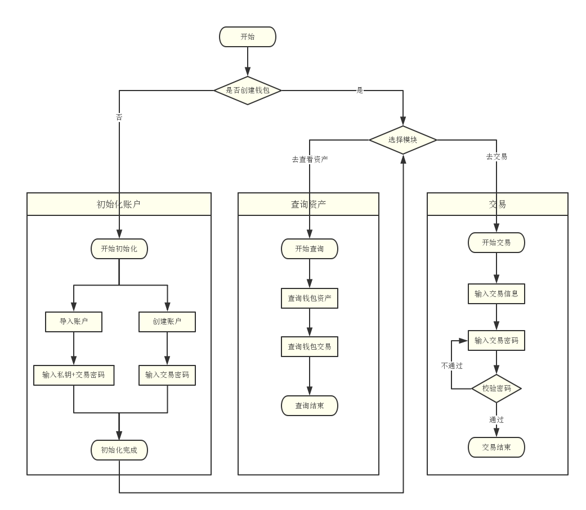
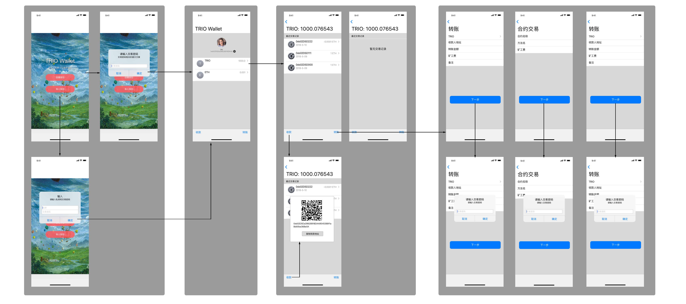

# WEB 数字钱包从产品到发布
从这篇文章中，我们可以看到一个产品的整个发布过程，它将从一个故事点、头脑风暴、功能确定、产品设计、开发最后到上线一系列过程，每个过程的思考和设计都将影响整个产品的最终形态，它并不是一个纯粹技术或者设计的问题，让我们看看一个产品到底是如何产生的。

## 用户故事
需求源于一个故事，多个故事形成一个产品。那么数字钱包这一产品，源于我对现在比特币、以太币等数字货币到底以什么形式存在。思考一下，如果未来一天数字货币真的开始流行，那么我的数字货币到底放在哪儿了？我怎么通过它来买我想要的东西呢？那么它和支付宝、微信钱包有区别吗？我们需要带着这个用户故事来开始对数字钱包的了解和设计。

## 用户功能
数字钱包，作为一个数字资产交易的工具，产品 Owner 需要做一些相关功课，至少要玩转一下各种不同的钱包 App，总结出产品的一些功能，当然可以对基本功能进行更多的扩展。通过一些调研和头脑风暴后，我们将列出如下用户可能用到的功能：

* 初始化钱包
    * 创建钱包
    * 导入钱包
        * 私钥导入
        * 助记词导入
        * Keystore 导入
        * 钱包地址导入（观察钱包）
    * 导出钱包
        * 私钥导出
        * 助记词导出
        * Keystore 导出
* 查询资产
    * ETH 总个数
    * Token 总个数
    * 交易列表查询
    * 交易详情
* 转账交易
    * ETH 转账
    * Token 转账
    * 调用合约
* 个人中心
    * 密码管理
    * 钱包管理
    * 联系人管理
    * 交易管理...
* 其它
    * 货币行情

这个过程非常重要，有可能你要做的产品都没有可以模仿的对象，它只是存在你头脑的一个想法而已，尽可能多的去发散思维，当然这些思考一定是源于你的这个想法，尽可能少的加入和这个产品无关的内容，保证这个产品是在解决这一类问题。

## MVP
当然如果采用 Scrum 敏捷方式来开发这个产品，我们要遵循 MVP（Minimum Viable Product） 原则，已最快的速度上线一个可用的版本，以上所有功能显然太过于庞大，以至于项目时间会拖得很长，我们会从中摘取最重要的功能：

* [High]创建钱包
* [High]私钥导入钱包
* [High]ETH & Token 总资产
* [High]ETH & Token 转账
* [High]交易列表
* [Low]交易详情
* [Low]调用合约

我们看看以上这 7 个功能，它在钱包的使用过程中都是不可或缺的，在整个交易生命周期中必备的过程（创建->查看->使用）。看起来只有 7 个主要页面，此时我们需要和极客们讨论产品的可行性和未来的产品方向，我们需要通过流程图和原型图来描述整个产品的使用过程，这是用户端的设计，要考虑到简单易用，流程尽量是一条直线尽可能少的分叉；每个页面功能职责要单一，不要让用户迷惑。接下来我们要做出最优化流程，和功能清晰的原型图。

## 流程图

简单解释一下这个流程图：
* 主流程：创建钱包->查询资产->交易
* 子流程
    * 初始化钱包：新建/导入->创建完成
    * 查询资产：查询钱包总资产->查询交易
    * 交易：输入交易信息->输入交易密码->完成交易

## 原型

简单描述每个页面的功能：
* 省略1w个字（难怪 PM 不愿意写 PRD）...

## 设计
设计是一件非常重要而有趣的事情，做得好会让你的产品容光焕发，不好的话可能会让你的产品惨遭吐槽。

## [技术]接口字段 (SDK)
* transactionObject
    * contract
    * methodName: String
    * arguments: Array
    * privateKey: String
    * from: String
    * to: String
    * value: 
    * gasLimit
    * gasPrice
    * data
    * none
* attributes
    * privateKey
    * publicKey
    * address
    * currency
* methods
    * generate([currency]): Object
    * import(key [, type] [, currency]): Object
        * type: 'privateKey', 'keystore', 'mnemonicPhrase', 'readonly'
        * key: string
        * currency: string
    * setProvider(host)
    * getBalance(addressHexString): Promise
    * getTokenBalance(addressHexString, contractAddress): Promise
    * getTransaction(transactionHash): Promise
    * contract(abi, address): Object
    * estimateGas(transactionObject): Promise
    * gasPrice(): Promise
    * sendTransaction(transactionObject): Promise

## 开始开发
接下就是产品 Owner 的讲故事能力了，需要把上面的产品从头到尾描述给开发者（工程师、设计师、交互设计师、测试工程师等），尽可能的将功能送到各位的脑子里面去，有问题要一起思考。

## 用 Scrum 来管理产品
我们可以用敏捷中的 Scrum 来管理产品的进行过程，通过 Backlog、白板、燃尽图等工具来推动产品的进展，用站立会、评审会、回顾会议来组织团队的协同工作，这样一来通过一个迭代周期（2周到4周）就可以去线上验证自己的产品和想法了。
